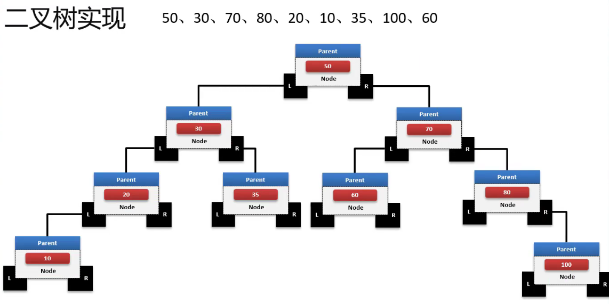
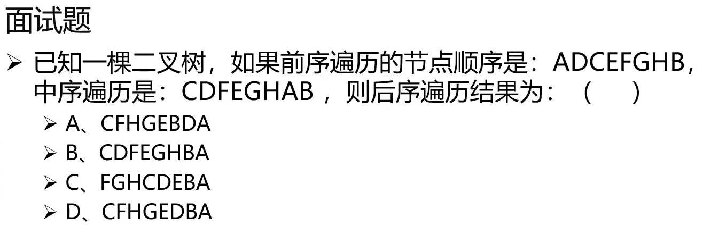
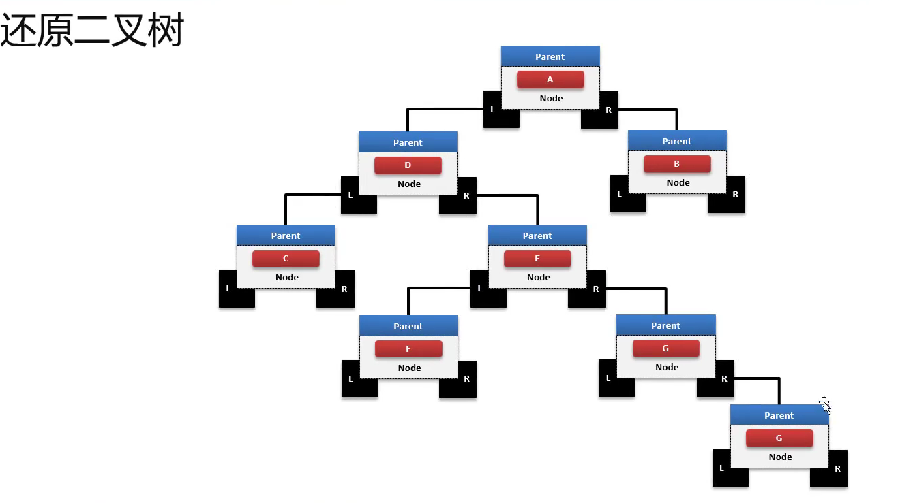
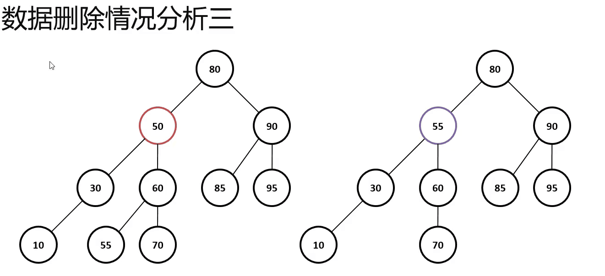

# 二叉树和红黑树

二叉树（Binary Tree、BT)是一种平衡的数据结构，其主要的目的是为了提升数据的查询性能。

树结构的Node节点和链表结构最大的不同在于：每一个节点中要保存有两个子节点，一个称为
"左子树"，另一个称为"右子树"。

对于这个两个节点的数据保存，需要按照如下的原则进行：

​	取第一个数据作为根节点的保存数据；

​	比根节点小的数据放在左子树(也可以保存相等的数据，或者干脆不保存相等)

​	比根节点大的数据放在右子树

当所有的数据全部保存完成之后则可以按照"中序遍历"的方式进行全部数据的获取；

关于二叉树的三种遍历模式

​	前序遍历 根- 左 - 右

​	中序遍历 左- 根 -右

​	后序遍历 左 - 右 - 根

前序遍历顺序(ADCEFGHB) 就可以确定根节点是A；

中序遍历顺序(CDFEGHAB) 由于已经确定了根节点A存在，所以自然B一定是根节点右节点 ；

根据中序节点推断出基本的左子树的所有的节点顺序(前序："DCEFGH"、中序："CDFGH")，可以发现D一定是一个跟节点，这样C和D的关系就可以直接确定下来；

确定好CD之后在去确定后续的几个几点(前序："DCEFGH"、中序："CDFEGH")，可以确定D的右子树为"FEGH"几个节点存储。

后序遍历顺序 CFHGEDBA 

二叉树节点删除的三种情况：

- 如果删除节点没有子节点，那么直接删除即可
- 如果待删除节点只有一个子节点，那么直接删掉，并用其子节点去代替它
- 如果待删除节点有两个子节点，这种情况比较复杂：首先找出他的后继节点，然后处理"后继节点"和"被删除节点的父节点"之间的关系，最后处理"后继节点的子节点"和"被删除节点的子节点"之间的关系

## 红黑树

二叉树最佳搜索性能的时间复杂度为"O(log2n)";但是只会出现绝对均衡的情况下才会存在的时间复杂度。每一个节点都能保持一个平衡。为了解决这种二叉树平衡问题，有了红黑树。

红黑树本质是一种二叉查找树，但它在二叉查找数的基础上添加了一个标记(颜色),同时具有一定的规则，使红黑树保证了一种平衡，插入，删除，查找最坏的时间复杂度都为O(logn)。

红黑树是在1972年由Rudolf Bayer发明的，当时被称为平衡二叉树B树(symmetric binry B-trees)。后来在1978年被Leo J.Guibas 和 Robert Sedgewick修改为当今的"红黑树"

平衡是红黑树结构的核心主题，而且可以发现有的节点是黑色，而有的节点是红色的。

红黑树特点：

​	每个节点或者是黑色，或者是红色；

​	根节点必须是黑色；

​	每个叶子节点是黑色；

​		java实现的红黑树将使用null来代表空节点，因此遍历红黑树时将看不到黑色的叶子节点，反而看到每个叶子节点都是红色的。

​	如果一个节点是红色的，则它的子节点必须是黑色的；

​		从每个跟到节点的路径上不会有两个连续的红色节点，但黑色节点是可以连续的 。若给定黑色节点的个数N，最短路径情况是连续的N个黑色，树的高度为N-1；最长路径的情况为节点红黑相间，树的高度为2(N-1)；

​	从一个节点到该节点的子孙节点的所有路径上包含相同数目的黑节点数量；

​	数量：

​		成为红黑树最主要的条件，后序的插入，删除条件都是为了遵守这个规定。

红黑树的设计原则：主要的原因是为了平衡修复，而对于平衡修复就需要采用如下集中自旋处理。

