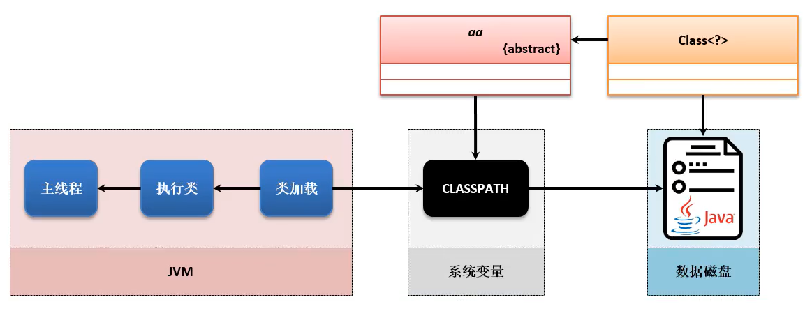
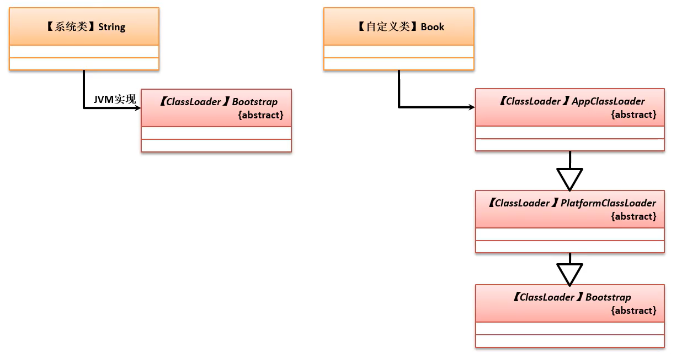

# 类加载器

类加载器，它可以在类加载到虚拟机的时候检查类的完整性。

1. 虚拟机有一个用于加载类文件的机制。例如，从磁盘上读取文件 或者 请求web上的文件；他使用该机制来加载 *.class文件中内容
2. 如果 *.class类 拥有类型为另一个类的 域，或者是拥有 超类(父类)，那么这些类文件也会被加载。(加载某个类所依赖的所有类的过程称为 类的 解析)
3. 接着，虚拟机执行*.class中的main方法
4. 如果main方法或者main调用的方法要用到更多的类，那么接下来就会加载这些类

- 引导 类加加载器 引导类加载器 负责加载 系统类(通常从 JAR文件rt.jar中进行 加载)。它是虚拟机不可分割的一部分，而且通常是用C语言来实现的。引导类加载器没有对应的ClassLoader对象。
- 扩展加载器 扩展加载器用于 从 jre/lib/ext目录加载 "标椎的扩展"。可以将JAR文件放入该目录，这样即使没有 任何 类路径，扩展类加载器也可以找到其中的各个类。
- 系统类加载器(有时也称为应用类加载器) 类加载用于加载应用类，它在CLASSPATH环境变量中或-classpath命令行选项设置的类路径中的目录或者是JAR/ZIP文件中 查找这些类。

## 类记载的层次结构

类记载器有一种父/子关系。除了引导类记载器外，每个类加载器都有一个父类加载器。根据规定，类加载器会为它的父类加载器提供一个机会，以便加载任何给定的列，并且只有在其父类加载器失败时，他才会加载该给定的类。
每个线程都有一个对类加载器的引用，称为上下文类加载器。主线程的上下文类加载器是系统记载器。当新线程创建时，他的上下文加载器会被设置成创建该线程的上下文类加载器。通过thread.getContextClassLoade()。

## 编写你自己的类加载器

继承ClassLoader类，并覆盖 findClass(String className)
ClassLoader超类的loadClass方法用于 将类的 加载委托给其 父类加载器 去进行。只有当该类尚未加载并且父类加载器也无法加载该类时，才调用findClass方法。

1. 为来自本地文件系统或者其他来源的类加载其字节码
2. 调用ClassLoader超类的defineClass方法，向虚拟机提供字节码

~~~java
			java.lang.Class
ClassLoader getClassLoader()
//获取加载该类的类加载器	

			java.lang.Thread
ClassLoader getContextClassLoader()
//获取类加载器，该线程的创建者将其指定为 执行该 线程时 最适合使用的类加载器
void setContexClassLoader(ClassLoader loader)
//为该线程中的代设置一个类加载器，以获取到要加载的类。如果在启动一个线程时没有显式地设置上下文类加载器，则使用父线程的上下文加载器。

			java.net.URLClassLoader
URLClassLoader(URL[] urls)
URLClassLoader(URL[] urls,ClassLoader parent)
//构建一个类加载器，他可以从给定的URL处加载类。如果URL以/结尾，那么它表示的一个目录，否则，它表示的是一个jar文件。
~~~

~~~java
			java.lang.ClassLoader
ClassLoader getParent()
//返回父类加载器，如果父类加载器是引导类加载器，则返回null
static ClassLoader getSystemClassLoader()
//获取系统类加载器，即用于加载第一个应用类的类加载器
protected Class findClass(String name)
//类加载器应该覆盖该方法 ，以查找类的字节码，并通过defineClas方法将字节码传给虚拟机。在类的名字中，使用.包名分隔符，并且不使用.class后缀
Class defineClass(String name,byte[] byteCodeData,int offset,int lenght)
//将一个新的类添加到虚拟机中，其字节码在给定的数据范围中。
~~~

已知ClassLoader有如下几个：

​	BootStarpt:此为JVM内部所提供的类加载器的处理机制，JVM原生提供的类机制，专门用于加载系统类

​	PlatformClassLoader：平台类的加载器 ，在JDK1.8以前叫ExtClassLoader

​		在JDK1.8及以前的所有的JDK里面为了方便进行第三方程序的扩展，会提供一个专属的ext目录

​			C:\Program Files\Java\jdk1.8.0_231\jre\lib\ext 此目录的优先级要高于ClassPath

​	AppClassLoader：应用程序加载器，用户自己定义的类的加载器 

