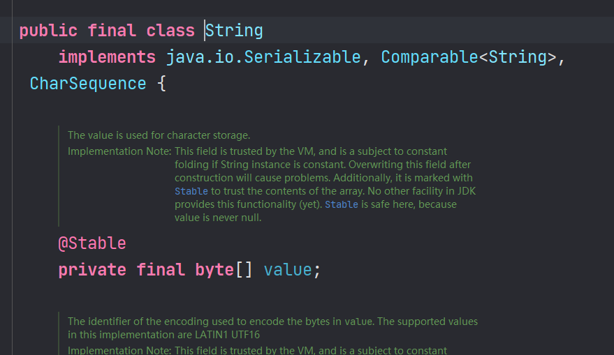

String的实现底层有 char\[] 改为 byte\[]，存储效率变高，调用效率同样变高

String: jdk8 及之前：底层使用 char\[]存储；jdk9 底层使用 byte\[] (encoding flag)
StringBuffer: jdk8 及之前，底层使用 char\[]存储；jkd9 底层使用 byte\[]
StringBuilder: jdk8 及之前，底层使用 char\[]存储；jkd9 底层使用 byte\[]
