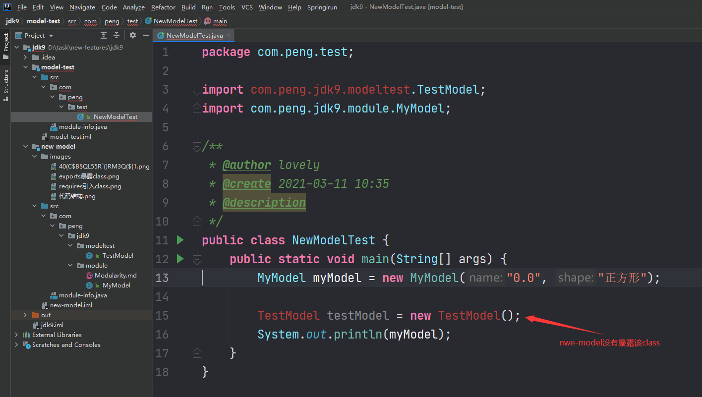

**代码示例**

从代码结构：

这个文件就是模块化文件

在 `module` 文件中直接 `exports`  关键字 + 包名路径就可以选择需要对外暴露的 `class`

当外部文件需要使用这个的时候，通过 `requires` 关键字 + `项目名`就可以导入该项目下暴露的类。

**总结**

模块化系统是基于`jar` 包和 `类` 之间存在的，目的在于尽可以能减少 jar 中多余类的加载，保证整体项目运行时的效率。对于项目运行肯定有一定的积极意义。

