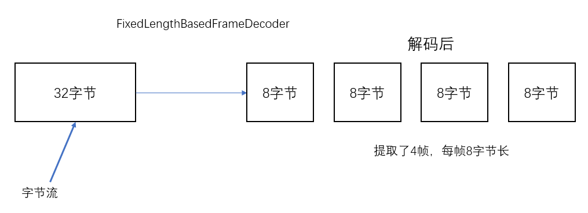
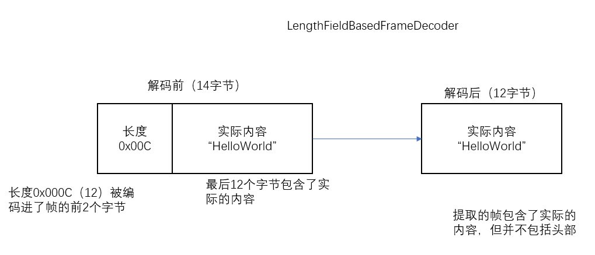

## 11.1 通过SSL/TLS保护Netty应用程序

SSL/TLS安全协议，它们层叠在其它协议之上，用以实现数据安全。

为了支持SSL/TLS，java提供了javax.net.ssl包，它的SSLContext的SSLEngine类使得实现解密和解密相当简单直接。Netty通过一个名为SslHandler的ChannelHandler实现利用了这个API，其中SslHandler在内部使用SSLEngine来完成实际的工作。

> Netty的OpenSSL/SSLEngine实现
>
> Netty还提供使用OpenSSL工具吧的SSLEngine实现，这个OpenSsl - Engine类提供了比JDK提供的SSLEngine实现更好的性能。
>
> 如果OpenSSSL库可用，可以将Netty应用 程序（客户端和服务器）配置为默认使用OpenSslEngine 。如果不可用，Netty将会 回退到JDK实现。
>
> 注意，无论你使用JDK的SSLEngine还是使用Netty的OpenSslEngine，SSL API 和数据流都是一致的。

~~~java
public class SslChannelInitializer extends ChannelInitializer<Channel>{
    private final SslContext context;
    private final boolean startTls;
    
    public SslChannelInitializer(SslContext context,boolean startTls){
        this.context = context;
        this.startTls = startTls;
    }
    protected void initChannel(Channel ch){
        SSLEngine engine = context.newEngine(ch.alloc());
        ch.pipeline().addFirst("ssl",new SslHandler(engine,startTls));
    }
}
~~~

SslHandler具有一些有用的方法，例如在握手阶段，两个节点将相互验证并且商定一种加密协方式。你可以通过配置SslHandler来修改它的行为，或者在SSL/TLS握手一旦完成之后提供通知，握手阶段完成之后，所有的数据都将会被加密。SSL/TLS握手将会被自动执行。

| 方法                                                         | 描述                                                         |
| ------------------------------------------------------------ | ------------------------------------------------------------ |
| setHandshakeTimeout(ling,TimeUnit) setHandshakeTimeoutMillis(long) setHandshakeTimeoutMillis() | 设置和获取超时时间，超时知乎，握手ChannelFuture将会被通知失败 |
| setClsoeNotifyTimeout(long,TimeUnit) setClsoeNotifyTimeoutMillis(long) setCloseNotifyTimeoutMillis() | 设置或获取超时时间，超时之后，将会触发一个关闭通知并关闭连接。这也将会导致该通知该ChannelFuture失败 |
| handshakeFuture()                                            | 返回一个在握手完成后将会先得到通知的ChannelFuture。如果握手先前已经执行过了，则返回一个包含了先前握手结果的ChannelFuture |
| close() close(ChannelPromise) close(ChannelHandlerContext,ChannelPromise) | 发送close_notify以请求关闭并销毁底层的SslEngine              |

## 构建基于Netty的HTTP/HTTPS应用程序

如上图所示：一个HTTP请求/响应可能由多个数据部分组成，并且它总是以一个 LastHttpContent部分作为结束。FullHttpRequest和FullHttpResponse消息是特殊的子类型，分别代表了完整的请求和响应，所有类型的HTTP消息（FullHttpRequest、LastHttpContent下表的类）都实现了HttpObject接口

| 名称                | 描述                                                        |
| ------------------- | ----------------------------------------------------------- |
| HttpRequestEncoder  | 将HttpReuqest、HttpContent和LastHttpContent消息编码为字节   |
| HttpResponseEncoder | 将HttpResponse、HttpContent和LastHtttpContent消息编码为字节 |
| HttpRequestDecoder  | 将字节解码为HttpReuqest、HttpContent和LastHttpContent消息   |
| HttpResponseDecoder | 将字节解码为HttpResponse、HttpContent和LastHttpContent消息  |

~~~java
public class HtttpPipelineInitializer extends ChannelInitializer<Channel>{
    private final boolean client;
    public HttpPipelineInitializer(boolean client){
        this.client = client;
    }
    
    protected void initChannel(Channel ch){
        ChannelPipeline pipeline = ch.pipeline();
        /*
         * 如果是服务器，添加HttpResponseEncoder以向客户端发送响应，以HttpRequestDecoder接收请求
         * 如果是客户端，添加HttpResponseDecoder接收响应，以HttpRequestDecodr发送请求。
         */
        if(client){
            pipeline.addLast("decoder",new HttpResponseDecoder());
            pipeline.addLast("encoder",new HttpRequestEncoder());
        }else{
            pipeline.addLast("decoder",new HttpRequestDecoder());
            pipeline.addLast("encoder",new HttpRepsoneEncoder());
        }
    }
}
~~~

### 11.2.2 聚合HTTP消息

~~~java
public class HtttpPipelineInitializer extends ChannelInitializer<Channel>{
    private final boolean client;
    public HttpPipelineInitializer(boolean client){
        this.client = client;
    }
    
    protected void initChannel(Channel ch){
        ChannelPipeline pipeline = ch.pipeline();
        /*
         * 如果是服务器，添加HttpResponseEncoder以向客户端发送响应，以HttpRequestDecoder接收请求
         * 如果是客户端，添加HttpResponseDecoder接收响应，以HttpRequestDecodr发送请求。
         */
        if(client){
            pipeline.addLast("decoder",new HttpResponseDecoder());
            pipeline.addLast("encoder",new HttpRequestEncoder());
        }else{
            pipeline.addLast("decoder",new HttpRequestDecoder());
            pipeline.addLast("encoder",new HttpRepsoneEncoder());
        }
        // 将最大消息大小为 512KB的HttpObjectAggregator添加到ChannelPipeline
        pipeline.addLast("aggregator",new HttpObjectAggregator(512 * 1024));
    }
}
~~~

### 11.2.3  Http 压缩

当使用HTTP时，建议开启压缩功能以尽可能多减小传输数据的大小。虽然压缩会带来一些CPU时钟周期上的开销，但是通常来说他都是一个好主意，特别是对于文本数据。

> **HTTP请求的头部信息**
>
> 客户端可以通过提供一下头部信息来指示服务器它所只会的压缩格式
>
> GET /url HTTP/1.1
>
> Host: localhost
>
> Accept-Encoding: gzip, deflate
>
> 然而，需要注意的是，服务器没有义务压缩它所发送的数据

~~~java
// 自定压缩Http消息
public class HtttpPipelineInitializer extends ChannelInitializer<Channel>{
    private final boolean client;
    public HttpPipelineInitializer(boolean client){
        this.client = client;
    }
    
    protected void initChannel(Channel ch){
        ChannelPipeline pipeline = ch.pipeline();
        /*
         * 如果是服务器，添加HttpResponseEncoder以向客户端发送响应，以HttpRequestDecoder接收请求
         * 如果是客户端，添加HttpResponseDecoder接收响应，以HttpRequestDecodr发送请求。
         */
        if(client){
            pipeline.addLast("decoder",new HttpResponseDecoder());
            pipeline.addLast("encoder",new HttpRequestEncoder());
        }else{
            pipeline.addLast("decoder",new HttpRequestDecoder());
            pipeline.addLast("encoder",new HttpRepsoneEncoder());
			// 添加HttpContentCompressor来压缩数据
            pipeline.addLast("compresspr",new HttpContentCompressor())
        }
        // 将最大消息大小为 512KB的HttpObjectAggregator添加到ChannelPipeline
        pipeline.addLast("aggregator",new HttpObjectAggregator(512 * 1024));
    }
}
~~~

### 11.2.4 使用HTTPS

启用HTTPS只需要将SslHandler添加到ChannelPipeline的ChannelHandler组合中

~~~java
// 自定压缩Http消息
public class HtttpPipelineInitializer extends ChannelInitializer<Channel>{
    private final boolean client;
    public HttpPipelineInitializer(boolean client){
        this.client = client;
    }
    
    protected void initChannel(Channel ch){
        ChannelPipeline pipeline = ch.pipeline();
        SSLEngine engine = context.newEngine(ch.alloc());
        pipeline.addFirst("ssl",new SslHandler(engine));
        /*
         * 如果是服务器，添加HttpResponseEncoder以向客户端发送响应，以HttpRequestDecoder接收请求
         * 如果是客户端，添加HttpResponseDecoder接收响应，以HttpRequestDecodr发送请求。
         */
        if(client){
            pipeline.addLast("decoder",new HttpResponseDecoder());
            pipeline.addLast("encoder",new HttpRequestEncoder());
        }else{
            pipeline.addLast("decoder",new HttpRequestDecoder());
            pipeline.addLast("encoder",new HttpRepsoneEncoder());
			// 添加HttpContentCompressor来压缩数据
            pipeline.addLast("compresspr",new HttpContentCompressor())
        }
        // 将最大消息大小为 512KB的HttpObjectAggregator添加到ChannelPipeline
        pipeline.addLast("aggregator",new HttpObjectAggregator(512 * 1024));
    }
}
~~~

### 11.2.5 WebSocket

WebSocket在客户端和服务器之间提供了真正的 `双向数据交换`。

WebSocketFrame可以被归类为数据帧或者控制帧。

WebSocketFrame类型

| 名称                       | 描述                                                         |
| -------------------------- | ------------------------------------------------------------ |
| BinaryWebSocketFrame       | 数据帧：二进制数据                                           |
| TextWebSocketFrame         | 数据帧：文本数据                                             |
| ContinuationWebSocketFrame | 数据帧：属于上一个BinaryWebSocketFrame或者TextWebSocketFrame的二进制或文本数据 |
| CloseWebSocketFrame        | 控制帧：一个CLOSE请求，关闭的状态码以及关闭的原因            |
| PingWebSocketFrame         | 控制帧：对PingWebSocketFrame请求的响应                       |
| PongWebSocketFrame         | 控制帧：请求一个PongWebSocketFrame请求的响应                 |

~~~java
public class WebSocketServerInitializer extends ChannelInitializer<Channel>{
	protected void initChannel(Channel ch){
        ch.pipeline().addLast(new HttpServerCodec(),
                              // 为握手提供聚合的HttpRequest
                              new HttpObjectAggregator(65546),
                              // 请求的端点是/websocket
                          	  new WebSocketServerProtocolHandler("/websocket"),
                              // 请求帧 处理
                              new TextFrameHandler(),
                              new BianryFrameHandler(),
                              new ContinuationFrameHandle());
    }
    
    public static final class TextFrameHandler extends SimpleChannelInboundHandler<TextWebSocketFrame>{
        public void channelRead0(ChannelHandlerContext ctx,TextWebSocketFrame msg){
            // Handle text frame
        }
    }
    
    public static final class BinaryFrameHandler extends SimpleChannelInboundHandler<TextWebSocketFrame>{
        public void channelRead0(ChannelHandlerContext ctx,TextWebSocketFrame msg){
            // Handle text frame
        }
    }
    
    public static final class ContinuationFrameHandler extends SimpleChannelInboundHandler<TextWebSocketFrame>{
        public void channelRead0(ChannelHandlerContext ctx,TextWebSocketFrame msg){
            // Handle text frame
        }
    }
}
~~~

> **保护WebSocket**
>
> ​	想要为WebSocket添加安全性，只需要将SslHandler作为第一个ChannelHandler添加到ChannelPipeline中。

## 11.3 空闲的连接和超时

检测空闲连接以及超时对于及时释放资源来说是至关重要的。

用于空闲连接以及超时 的ChannelHandler

| 名称                | 描述                                                         |
| ------------------- | ------------------------------------------------------------ |
| IdleStateHandler    | 当连接空闲的时间太长时，将会触发一个IdleStateEvent事件。然后你可以通过在你的ChannelInboundHnadler中重写userEventTriggered()方法来处理该IdleStateEvent时间 |
| ReadTimeoutHandler  | 如果在指定的时间间隔内没有收到任何的入站数据，则抛出一个ReadTimeoutException并关闭对应的Channel。可以通过重写你的ChannelHandler中的exceptionCaught()方法来检测该ReadTimeoutException |
| WriteTimeoutHandler | 如果在指定的时间间隔内没有任何出站数据写入。则抛出一个WriteTimeoutException并关闭对应的Channel。可以通过重写你的ChannelHnadler的exceptionCaught()方法检测WriteTimeoutException |

~~~java
public class IdleStateHandlerInitializer extends ChannelInitializer<Channel>{
    protected void initChannel(Channel ch){
        ChannelPipeline pipeline = ch.pipeline();
        pipeline.addLast(new IdleStateHandler(0,0,60,TimeUnit.SECONDS));
        pipeline.addLast(new HeartbeatHandler());
    }
    
    private static final class HeartbeatHandler extends ChannelInboundHandler{
        // 发送到远程节点的心跳消息
        private static final ByteBuf HEARTBEAT_SEQUENCE = Unpooled.unreleasableBuffer(Unpooled.copied("HEARTBEAT",ChannelUtil.UTF_8));
        
        public void userEventTriggered(ChannelHandlerContext ctx,Object evt){
            if(evt instanceof IdleStateEvent){
                // 发送心跳信息，并在发送失败的时候关闭该连接
                ctx.writeAndFlush(HEARTBEAT_SEQUENCE.duplicate())
                    .addListener(ChannelFutureListener.CLOSE_ON_FAILURE);
            }else{
                // 不是IdleStateEvent事件，所以将它传递给下一个ChannelInboundHandler
                super.userEventTriggered(ctx,evt);
            }
        }
    }
}
~~~

## 11.4 解码基于分隔符的协议和基于长度的协议

### 11.4.1 基于分割符的协议

`基于分隔符的（delimite）`消息协议使用定义的字符来标记的消息或者消息段（通常被称为帧）的开头或者结尾。无论使用什么样的协议，下表列出的解码器都能定义可以提取由任意标记（token）序列分隔的帧的自定义解码器。

| 名称                      | 描述                                                         |
| ------------------------- | ------------------------------------------------------------ |
| DelimiterBaseFrameDecoder | 使用任何由用户提供的分隔符来提取帧的通用解码器               |
| LineBasedFrameDecoder     | 提取由行尾符（\\n或者\\r\\n）分隔的帧的解码器。这个解码器比DelimiterBasedFrameDecoder更快。 |

~~~java
// 处理由行尾符分隔的帧
public class LineBaseHandlerInitializer extends ChannelInitializer<Channel>{
    protected void initChannel(Channel ch){
        ChannelPipeline pipeline = ch.pipeline();
        pipeline.addLast(new LineBasedFrameDecoder(64 * 1024));
        pipeline.addLast(new FrameHandler());
    }
    
    public static final class FrameHandler extends SimpleChannelInboundHandler<ByteBuf>{
        public void channelRead0(ChannelHandlerContext ctx,ByteBuf msg){
            // do something with the data extracted from the frame
        }
    }
}
~~~

DelimiterBasedFrameDcoder，只需要将特定的分隔符序列指定到其构造函数即可。

协议规范：

* 传入数据流是一系列的帧，每个只能都由换行符（\\n）分隔
* 每个帧都由一系列的元素组成，每个元素都由单个空格字符分隔
* 一个帧的内容代表一个命令，定义为一个命令名称后跟着数目可变的参数

 用于这个协议的自定义解码器将定义以下类：

* Cmd——将帧（命令）的内容存储在ByteBuf中，一个ByteBuf用于名称，另一个用于参数
* CmdDecoder——从被重写了的decode()方法中获取一行字符串，并从它的内容构建一个Cmd的实例。
* CmdHandler——从CmdDecoder获取解码的Cmd对象，并对它进行一些处理
* CmdHandlerInitializer——为了简便起见，将会把前面的这些类定义为专门的ChannelInitializer的嵌套类，其将会把这些ChannelInboound安装到ChannelPipeline中。

~~~java
// 使用ChannelInitializer
public class CmdHandlerInitializer extends ChannelInitializer<Channel>{
    final byte SPACE = (byte)' ';
    protected void initChannel(Channel ch){
        ChannelPipeline pipeline = ch.pipeline();
        pipeline.addLast(new CmdDecoder(64 * 1024));
        pipeline.addLast(new ComdHanlder());
    }
    
    public static final class Cmd{
        private final ByteBuf name;
        private final ByteBuf args;
        
        public Cmd(ByteBuf name,ByteBuf args){
            this.name = name;
            this.args = args;
        }
    }
    
    public static class CmdDecoder extends LineBaseFrameDecoder{
        public CmdDecoder(int maxLength){
            super(maxLength);
        }
        
        protected Object decode(ChannelHandlerContext ctx,ByteBuf buffer){
            ByteBuf frame = (ByteBuf)super.decode(ctx,buffer);
            if(frame == null)
                return null;
            int index = frame.indexOf(frame.readerIndex(),frame.writeIndex(),SPACE);
            return new Cmd(frame.slice(frame.readerIndex(),index),frame.slice(index + 1,frame.writeIndex()));
        }
    }
    
    public static final class CmdHandler extends SimpleChannelInboundHandler<Cmd>{
        public void channelRead0(ChannelHandlerContext ctx,Cmd cmd){
            // Do something with the command
        }
    }
}
~~~

### 11.4.2 基于长度的协议

基于长度的协议通过将它的长度编码到帧的头部来定义帧，而不是使用特殊的分隔符来标记它的结束。

| 名称                         | 描述                                                         |
| ---------------------------- | ------------------------------------------------------------ |
| FixedLengthFrameDecoder      | 提取在调用构造函数时指定的定长帧                             |
| LengthFieldBasedFrameDecoder | 根据编码进帧头部中的长度提取帧，该字段的偏移量以及长度在构造函数中指定 |

LengthFieldBaseFrameDecoder它将从头部字段确定帧尝，然后从数据中提取指定的字节数。

~~~java
// 使用LengthFieldBasedFrameDecoder解码器基于长度的协议
public class LengthBasedInitializer extends ChannelInitializer<Channel>{
    protected void initChannel(Channel ch){
        ChannelPipeline pipeline = ch.pipeline();
        pipeline.addLast(new LengthFieldBasedFrameDecoder(64 * 1024, 0 , 0 , 8));
        pipeline.addLast(new FrameHandler());
    }
    
    public static final class FrameHandler extends SimpleChannelInboundHandler<ByteBuf> {
        public void channelRead0(ChannelHandlerContext ctx,ByteBuf msg){
          	// Do something with the frame   
        }
    }
}
~~~

## 11.5写大型数据

FileRegion接口，通过支持零拷贝的文件传输的Channel来发送的文件区域。

~~~java
FileInputStream in = new FileInputStream(file);
FileRegion region = new DefaultFielRegion(in.getChannel() , 0 , file.length());
channel.writeAndFlush(region).addListener(new ChannelFutureListener(){
   public void operationComplete(ChannelFuture future){
       if(!future.isSuccess()){
           Throwable cause = future.cause();
           // Do something
       }
   } 
});
~~~

上面实例只适合于文件内容的直接传输，不包括应用程序对数据的任何处理。

在需要将数据从文件系统复制到用户内存时，可以使用`ChunkedWriteHandler`，它支持异步写大型数据流，而又不会到最后大量的内存消耗 。

关键是 interface ChunkedInput\<B> 其中类型参数B是readChunk()方法返回的类型。Netty预置了该接口的**4个实现**（下表中）。每个都代表了一个将由ChunkedWriteHandler处理的不定长度的数据流。

| 名称             | 描述                                                         |
| ---------------- | ------------------------------------------------------------ |
| ChunkedFile      | 从文件中逐块获取数据，当你的平台不支持零拷贝或者你需要转换数据时使用 |
| ChunkedNioFile   | 和ChunkedFile类似，只是它使用了FileChannel                   |
| ChunkedStream    | 从InputStream中逐块传输内容                                  |
| ChunkedNioStream | 从ReadableByteChannel中逐块传输内容                          |

~~~java
public class ChunkedWriteHandlerInitializer extends ChannelInitializer<Channel>{
    private final File file;
    private final SslContext sslCtx;
    
    public ChunkedWriteHandlerInitializer(File file,SslContext sslCtx){...}
    
    protected void initChannel(Channel ch){
        ChannelPipeline pipeline = ch.pipeline();
        pipeline.addLast(new SslHandler(sslCtx.newEngine(ch.alloc())));
        pipeline.addLast(new ChunkedWriteHandler());
        pipeline.addLast(new ChunkedStreamHandler());
    }
    
    public final class WriteStreamHandler extends ChannelInboundHandlerAdapter{
        public void channelActive(ChannelHandlerContext ctx){
            suepr.channelActive(ctx);
            ctx.writeAndFlush(new ChunkedStream(new FileInputStream(file)));
        }
    }
}
~~~

## 11.6 序列化数据

JDK提供了 ObjectOutptStream 和 ObjectInputStream，用于网络对POJO的基本数据类型和图进行序列化和反序列化。但是它的性能也不是非常高效。

### 11.6.1 JDK序列化

​	