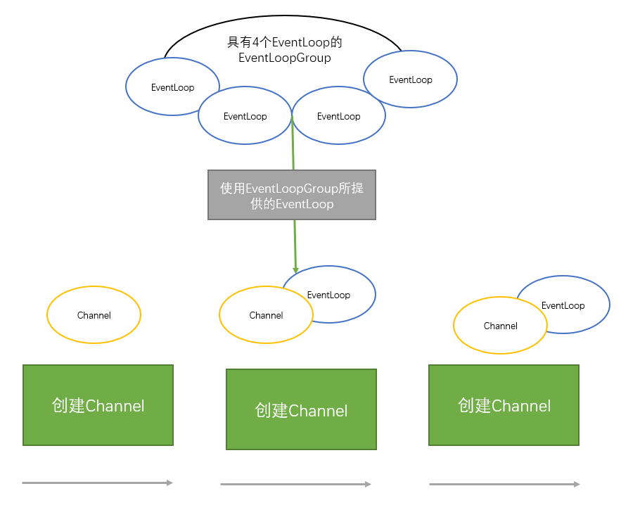
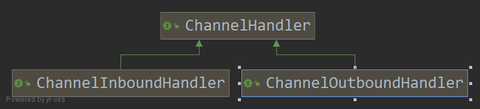

## 3.1

Channel —— Socket

EventLoop —— 控制流，多线程处理，并发。

ChannelFuture —— 异步通知

### 3.3.1 Channel接口

* EmbeddedChannel

* LocalServerChannel

* NioDatagramChannel

* NioSctpChannel

* NioSocketChannel

### 3.1.2

EventLoop定义了Netty的核心抽象，用于处理连接的生命周期所发生的事件。

图上，Channel、EventLoop和EventLoopGroup关系：

* 一个EventLoopGroup包含一个或者多个EventLoop

* 一个EventLoop在它的生命周期内只和一个Thread绑定

* 所有由EventLoop处理的I/O事件都将在它专有的Thread上处理。

* 一个Channel在它的生命周期内只注册于一个EventLoop

* 一个EventLoop可能会被分配一个或者多个Channel。

一个给定的Channel的I/O操作都是由相同的Thread执行，实际上消除了对于同步的需要。

### 3.1.3 ChannelFuture接口

ChannelFuture接口，其addListener()方法注册了一个ChannelFutureListener，以便在某个操作完成时（无论是否成功）得到通知。

## 3.2 ChannelHandler和ChannelPipeline

### 3.2.1 ChannelHandler 接口

ChannelHandler，它充当了所有处理入站和出站数据的应用程序逻辑的容器

ChannelHandler可专门用于几乎任何类型的动作。

ChannelInboundHandler用于接收入站事件和数据。

### 3.2.2 ChannelPipeline接口

ChannelPipeline为ChannelHandler链提供了容器，并定义了用于该链上传播入站和出站事件流的API。当Channel被创建时，他会自动分配到它专属的ChannelPipeline。

ChannelHandler安装到ChannelPipeline中过程如下所示：

* 一个ChannelInitializer的实现被注册到了ServerBootStrap中

* 当ChannelInitializer.initChannel()方法被调用时，ChannelInitializer将在ChannelPipeline中安装一组自定义的ChannelHandler

* ChannelInitializer将它自己从ChannelPipeline中移除。

ChannelHandler是转为支持广泛的用途而设计的，可以将它看作是 处理往来ChannelPipeline事件（包括数据）的任何代码的通用容器。

ChannelHandler对象接收事件、执行它们所实现的处理逻辑，并将数据传递给链中的下一个ChannelHandler,它们的执行顺序是由它们被添加到ChannelPipeline的顺序来决定的。

一个Netty应用程序中 入站和出站 数据流之间的区别，从一个客户端的角度来看，如果事件的运动方向是从客户端到服务器端，那称之为`出站`，反之称为`入站`。

当ChannelHandler被添加到ChannelPipeline时，它将会被分配一个`ChannelHandlerContext`，其代表了ChannelHandler和ChannelPipeline之间的绑定。

虽然`ChannelHandlerContext`可以获取底层的Channel，但是它主要还是用于写 出站数据。

在Netty中，有两种发送消息的方式，可以通过Channel发送，也可以使用ChannelHandlerContext发送。前一种方式会导致消息ChannelPipeline的尾端开始流动，而后者将导致消息从ChannelPipeline的下一个ChannelHandler开始流动 

> 为什么需要适配器类 
> 有一些适配器类可以将编写自定义的ChannelHandler所需要的努力降到最低，因为它们提供了定义在对应接口中的所有方法默认实现。
> 常用的适配器类
> * ChannelHandlerAdapter
> * ChannelInboundHandlerAdapter
> * ChannelOutboundHandlerAdapter
> * ChannelDupleHandler

### 3.2.4 编码器与解码器

网络数据总是一系列的字节。这是就需要进行编码解码。

### 3.2.5 抽象类 SimpleChannelInboundHandler

可以处理你想要处理的自己的<T>类型。

channelRead0(ChannelHandlerContext ,T)除了要求不要阻塞的当前的I/O线程之外，其具体实现完全取决于你。

## 3.3

面向连接的协议，"连接"这个术语仅适用于面向连接的协议，如果TCP，其保证了两个连接端点之间消息的有序传递。

客户端（Bootstrap），服务器（ServerBootStrap）

| 类别                 | Bootstrap            | ServerBootStrap    |
| -------------------- | -------------------- | ------------------ |
| 网络编程中的作用     | 连接到远程主机和端口 | 绑定到一个本地端口 |
| EventLoopGroup的数目 | 1                    | 2                  |

## 总结

