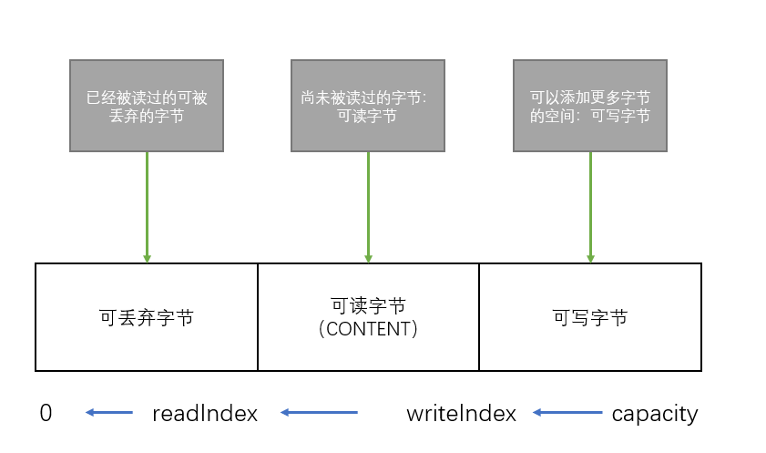
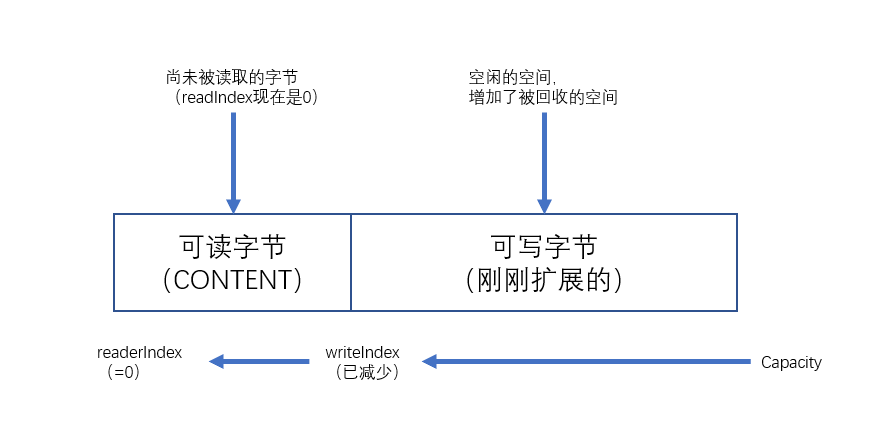

## ByteBuffer的 API

Netty的数据处理API通过两个组件暴露——abstract class ByteBuf 和 interface  ByteBufHolder

* 它可以被用户自定义的缓冲区类型扩展

* 通过内置的复合缓冲类型实现了透明的零拷贝

* 容量可以按需增长（类似于JDK的StringBuilder）

* 在读和写这两种模式之间切换不需要调用ByteBuffer的flip()方法

* 读和写使用了不同索引

* 支持方法的链式调用

* 支持引用计数

* 支持池化

其它类可用于管理ByteBuf实例的分配，以及执行各种针对数据容器本身和它持有的数据的操作。

### ByteBuf类——Netty的数据容器

ByteBuf维护了两个不同的索引：一个用于读取，一个用于写入。当你从ByteBuf读取时，它的readerIndex将会被递增已经被读取的字节数。同样的，当你写入ByteBuf时，它的writeIndex也会被递增。

### ByteBuf的使用模式

#### 1.堆缓冲区

最常用的ByteBuf模式是将数据存储在JVM的堆空间中。这种模式被称为支撑数组(backing array)，它能在没有使用池化的情况下提供快速的分配和释放。

~~~java
ByteBuf heapBuf = ...;
if(heapBuf.hasArray()) { // 检查ByteBuf是否有一个支撑数组,返回false，尝试访问支撑数据将触发UnsupportedOperationException
    byte[] array = heapBuf.array();
    int offset = heapBuf.arrayOffset(); // 计算第一个字节的偏移量
    int length = heapBuf.readableBytes();
    handleArray(array,offset,length);   
}
~~~

#### 2.直接缓冲区

*直接缓冲区*是另外一种ByteBuf模式。允许JVM实现通过本地调用来分配内存，这主要是避免在每次调用本地I/O操作之前（或者之后）将缓冲区的内容复制到一个中间缓冲区（或者从中间缓冲区把内容复制到缓冲区）。

直接缓冲区的缺点：相对于基于堆的缓冲区，它们的分配和释放都较为昂贵。

~~~java
ByteBuf directBuf = ...;
if(!directBuf.hasArray()){
    int length = directBuf.readableBytes();
    byte[] array = new byte[];
    directBuf.getBytes(directBuf.readerIndex(),array);  // 将字节复制到该数组
    handleArray(array,0,length);
}
~~~

#### 复合缓冲区

他为多个ByteBuf提供一个聚合视图。

Netty通过一个ByteBuf子类——CompositeByteBuf——实现了这个模式，它提供了一个将多个缓冲区表示为单个合并缓冲区的虚拟表示。

> CompositeByteBuf中的ByteBuf实例可能同时包含直接内存分配和非直接内存分配。
> 如果其中只有一个实例，那么对CompositeByteBuf上的hasArray()方法的调用将返回该组件上的hasArray()方法的值，否则它将返回false。

~~~java
// 使用ByteBuffer的复合缓冲区
// Use an array to hold the message parts
ByteBuffer[] message = new ByteBufer[]{header,body};
// Create a new ByteBuffer and user copy to merge the header and body
ByteBufer message2 = ByteBuffer.allocate(header.remaining() + body.readmaining());
message2.put(header);
message2.put(body);
message2.flip();
~~~

分配和复制操作，以及伴随着对数组管理的需要，使得实现效率低下而且笨拙。

~~~java
// 使用CompositeByteBuf的复合缓冲区模式
CompositeByteBuf messageBuf = Unpooled.compositeBuffer();
ByteBuf headerBuf = ...;    // can be backing or direct
ByteBuf bodyBuf = ...;      // can be backing or direct
messageBuf.addComponents(headerBuf,bodyBuf);
...
messageBuf.removeComponents(0); // remove the header
for(ByteBuf buf : messageBuf){
    System.out.println(buf.toString()); // 循环所有的ByteBuf实例 
}
~~~

CompositeByteBuf可能不支持访问其 支撑附属，因此访问CompositeByteBuf中的数据类似于（访问）直接访问缓冲区的模式。

~~~java
// 访问CompositeByteBuf中的数据
CompositeByteBuf compBuf = Unpooled.compositeBuffer();
int length = compBuf.readableBytes();
byte[] array = new byte[length];

compBuf.getBytes(compBuf.readerIndex(),array);
handleArray(array,0,array.length);
~~~

CompositeByteBuf API 除了从ByteBuf继承的方法，CompositeByteBuf提供了大量的附加功能。

## 5.3 字节操作

ByteBuf提供了许多超过基本读、写操作的方法用于修改它的数据。

### 5.3.1 随机访问索引

ByteBuf的索引是从零开始的：第一字节的索引是0，最后一个字节索引总是capacity() - 1。

~~~java
ByteBuf buffer = ...;
for(int i = 0 ; i < buffer.capacity() ; i++){
    byte b = buffer.getByte(i);
    System.out.println((char)b);
}
~~~

### 5.3.2 顺序访问索引

虽然ByteBuf同时具有读索引和写索引，JDK的ByteBuffer却只有一个索引，这就是为什么必须调用flip()方法在读模式和写模式之间进行切换的原因。

### 5.3.3 可丢弃字节

将丢弃字节分段的空间变为可写的。

通过调用discardReadBytes()方法，可以丢弃它们并回收空间。

### 5.3.4 可读字节

ByteBuf的可读字节分段存储了实际数据。新分配的、包装的或者复制的缓冲区的默认readerIndex值为0。

readBytes();

~~~java
// 读取所有数据
ByteBuf buffer = ...;
while(buffer.isReadable()){
    System.out.println(buffer.readBytes());
}
~~~

### 5.3.5 可写字节

可写字节分段是指一个拥有未定义内容的、写入就绪的内存区域。新分配的缓冲区的writeIndex的默认值为0。

writeBytes();

### 5.3.6 索引管理

markReaderIndex()、markWriteIndex()、restWriteIndex()、resetReaderIndex()来标记和重置ByteBuf的readerIndex和writeIndex。

clear()会让readerIndex和writeIndex都重置为0。但不会清除内存中的内容。

### 5.3.7 查找操作

~~~java
ByteBuf buffer = ...;
int index = buffer.forEachByte(ByteBufProcessor.FIND_CR);
~~~

### 5.3.8 派生缓冲区

* duplicate()

* slice()

* slice(int,int)

* Unpooled.unmodifiableBuffer(...);

* order(ByteOrder)

* readSlice(int)

这些方法都将返回一个新的ByteBuf实例，它具有自己的读索引，写索引和标记索引。其内部存储和JDK的ByteBuffer一样也是共享的。这使得派生缓冲区的创建成本是很低廉的，但是这也意味着，如果修改了它的内容，也同时修改了其对应的源实例。

> ByteBuf复制，使用copy()或者copy(int,int)方法。

get()

| 名称                   | 描述                                                 |
| ---------------------- | ---------------------------------------------------- |
| getBoolean(int)        | 返回给索引处的Boolean值                              |
| getByte(int)           | 返回给定索引处的字节                                 |
| getUnsignedByte(int)   | 返回给定索引处的无符号字节值作为short返回            |
| getMedium(int )        | 返回给定索引处的24位的中等int值                      |
| getInt(int)            | 返回给定索引处的Int值                                |
| getUnsignedMedium(int) | 返回给定索引处的无符号的24位的中等int值。            |
| getLong(int)           | 返回给定索引处的Long值                               |
| getShort(int)          | 返回给定索引处的short值                              |
| getUnsignedShort(int)  | 将给定索引处的无符号short值作为int返回               |
| getBytes(int,...)      | 将该缓冲区中从给定索引开始的数据传送到 指定 的目的地 |

一下set，read，write跟上面的一样。

| 名称             | 描述                                                         |
| ---------------- | ------------------------------------------------------------ |
| isReadable()     | 如果至少有一个字节可供读取，则返回true                       |
| isWriteable()    | 如果至少有一个字节可被写入，则返回 true                      |
| readableBytes()  | 返回可被读取的字节数                                         |
| writeableBytes() | 返回可被写入的字节数                                         |
| capacity()       | 返回ByteBuf可容纳的字节数。在此之后，它会尝试再次扩展直到到达maxCapacity() |
| maxCapacity()    | 返回ByteBuf可以容纳的最大字节数                              |
| hasArray()       | 如果ByteBuf由一个字节数组支撑，则返回true                    |
| array()          | 如果ByteBuf由一个字节数组支撑则返回该数组。                  |

## 5.4 ByteBufHolder 接口

ByteBufHolder也为Netty的高级特性提供了支持，如缓冲区优化，其中可以从 池中借用ByteBuf，并且在需要时自动释放。

ByteBufHolder只有几种用于底层数据和引用计数的方法

| 名称       | 描述                                                         |
| ---------- | ------------------------------------------------------------ |
| content()  | 返回由这个ByteBufHolder所持有的ByteBuf                       |
| copy()     | 返回这个ByteBufHolder的一个深拷贝，包括一个其所包含的ByteBuf的非共享副本 |
| uplicate() | 返回这个ByteBufHolder的一个深拷贝，包括一个其所包含的ByteBuf的共享副本 |

## 5.5 Byte

### 5.5.1

为了降低分配和释放资源内存的开销，Netty通过interrface ByteBufAllocator 实现了（ByteBuf的）池化，他可以用来分配任意类型的ByteBuf实例。

| 名称                                                         | 描述                                                         |
| ------------------------------------------------------------ | ------------------------------------------------------------ |
| buffer() buffer(int initialCapacity) buffer(int initialCapacity,int maxCapacity) | 返回一个基于堆或者直接存储的ByteBuf                          |
| heapBuffer heapbuffer(int initialCapacity) heapbuffer(int initialCapacity,int maxCapacity) | 返回一个基于堆的内存存储的ByteBuf                            |
| directBuffer() directBuffer(int initialCapacity) directBuffer(int initialCapacity,int maxCapacity) | 返回一个基于直接内存存储的ByteBuf                            |
| compositeBuffer() compositeBuffer(int maxNumComponents) composteDirectBuffer() compisteHeapBuffer() | 返回一个可以通过添加最大到指定数目 的基于堆的或 直接内存储的缓冲区来扩展CompositeByteBuf |
| ioBuffer()                                                   | 返回一个用于套接字的I/O操作的ByteBuf                         |

可以通过Channe(每个都可以有一个不同的ByteBufAllocator实例)或者绑定到ChannelHandler的ChannelHandlerContext获取到一个ByteBufAllocator的引用。

~~~java
Channel channel = ...;
ByteBufAlocator allocator = channel.alloc();
...
ChannelHandlerContext ctx = ...;
ByteBufAllocator allocator2 = ctx.alloc();
~~~

Netty提供了两种ByteBufAllocator的实现：PooledByteBufAllocator和UnpooledByteBufAllocator。前者池化了ByteBuf的实例以提高性能并最大限度地减少内存碎片，此实现是用来一种称为 `jemalloc`的已被大量现代操作系统所采用的高效方法来分配内存。

后者的实现不池化 ByteBuf实例，并且在每次调用它被调用时都会返回一个新的实例。

### 5.5.2 Unpooled缓冲区

| 名称                                                         | 方法                                      |
| ------------------------------------------------------------ | ----------------------------------------- |
| buffer() buffer(int initialCapacity) buffer(int initialCapacity,int maxCapacity) | 返回一个未池化的基于堆内存存储的ByteBuf   |
| directBuffer() directBuffer(int initialCapacity) directBuffer(int initialCapacity,int maxCapacity) | 返回一个未池化的基于直接内存存储的ByteBuf |
| wrappedBuffer()                                              | 返回一个包装了给定数据的ByteBuf           |
| copiedBuffer()                                               | 返回一个复制了给定数据的ByteBuf           |

## 5.6 引用计数

引用计数是一种通过在某个对象所持有的资源 不再被其它对象引用的时 释放该对象所持有的资源来优化内存使用和性能的技术。

ByteBuf和ByteBufHolder引入了 引用计数技术，它们都实现了interface ReferenceCounted。

引用计数对于池化实现（如PooledByteAllocator）来说是至关重要的，它降低了内存分配的开销

~~~java
Channel channel = ...;
ByteBufAllocator allocator = channel.alloc();
...
ByteBuf buffer = allocator.directBuffer();
assert buffer.refCnt() = 1;

...
ByteBuf buffer = ...;
boolean released = buffer.release();
~~~

### 6.1.2 ChannelHandler的生命周期

interface ChannelHandler定义的生命周期操作，在ChannelHandler被添加到ChannelPipeline中或者被从ChannelPipeline中或者被从ChannelPipeline中移除时会调用这些操作。这些方法中的每一个都接受一个ChannelHandlerContext参数

