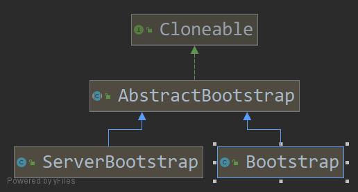

## 8.1 Bootstrap类

引导类的层次包括一个抽象类和两个具体的引导子类。

`服务器`和`客户端`用来支持不同的应用程序的功能。

服务器致力于使用一个`父Channel`来接收客户端的连接，并创建`子Channel`以用于它们之间的通信。

客户端最可能只需要一个单独的、没有`父Channel`的Channel来用于所有的网络交互。

两种类型的通用的引导步骤由`AbstractBootstrap`来处理，而特定的客户端或者服务器的引导步骤则分别由Bootstrap或ServerBootstrap来处理。

>**为什么引导类是Clonable的**
>
>有时可能需要创建多个具有类似配置或者完全相同配置的Channel。为了支持这模式而又不需要为每个Channel都创建并配置一个新的引导类实例，AbstractBootstrap被标记为了Clonabl。在一个已经配置完成的引导类实例上调用clone()方法将返回另一个可以立即使用的引导类实例。
>
>**注意**，这种方式只会创建引导类实例的EventBootstrapGroup的一个浅拷贝，所以，EevntLoopGroup将在所有克隆的Channel实例之间共享。这是可以接受的，因为这些通常 克隆的 Channel的生命周期都很短暂，一个典型的场景是——创建一个Channel以进行一次HTPP请求。

AbstractBootstrap类的完整声明是：

~~~java
public abstract class AbstractBootstrap<B extends AbstractBootStrap<B,C>, C extends Channel>{}
~~~

在这个签名中，子类型B是其父类型的一个类型参数，因此可以返回到运行时实例的引用以支持方法的链式调用（也就是所谓的**流式语法**）

其子类声明如下：

~~~java
public class Bootstrap extends AbstractBootStrap<Bootstrap,Channel>{}
public class ServerBootstrap extends AbstractBootstrap<Bootstrap,Channel>{}
~~~

## 8.2 引导客户端和无连接协议

| 名称                                                         | 描述                                                         |
| ------------------------------------------------------------ | ------------------------------------------------------------ |
| Bootstrap group(EventLoopGroup)                              | 设置用于处理Channel所有事件的EventLoopGroup                  |
| Bootstrap channel(Class<? extends C>) Bootstrap channelFactory(ChannelFactory<? extends C>) | channel()方法指定了Channel的实现类（内部使用了反射来实现）， 可以通过调用channelFacoty()方法来指定一个工厂类，它将会被bind()方法调用 |
| \<T> Bootstrap localAddress(SocketAddress)                   | 指定Channel应该绑定到本地的地址，如果没有指定，则将由 操作系统创建的随机的地址，或者可以通过bind()或者connect()方法指定localAddress |
| \<T> Bootstrap option(ChannelOption\<T> option,T value)      | 设置ChannelOption，其将应用到每个新创建的Channel的ChannelConfig。 这些选项将会通过bind()或者connect()方法设置到channel， 不管哪个先被调用。这个方法在Channel已经被创建后再调用不会有任何效果。 支持的ChannelOption取决于使用的Channel类型 |
| \<T> Bootstrap attr(Attribute\<T> key,T value)               | 指定新创建的Channel属性值。这些属性值是通过bind()或者connect()方法设置到Channel的，具体取决于谁先被调用。 |
| Bootstrap handler(ChannelHanlder)                            | 设置将被添加到ChannelPipeline以接收事件通知的ChannelHandler  |
| Bootstrap clone()                                            | 创建一个当前Boostrap的克隆，具有和原始的Bootstrap相同的设置信息。 |
| Bootstrap remoteAddress(SocketAddress)                       | 设置远程地址，或者，也可以通过connect()方法来指定它          |
| ChannelFuture connect()                                      | 连接到远程节点并返回一个ChannelFuture，其将会在连接操作完成后接收到通知 |
| ChannelFuture bind()                                         | 绑定Channel并返回一个ChannelFuture，其将会在绑定操作完成后接收到通知， 在那之后必须调用Channel.connect()方法来建立连接。 |

### 8.2.1 引导客户端

Bootstrap类负责为客户端是使用无连接协议的应用程序创建Channel。

~~~java
EventLoopGroup group = new NioEventLoopGroup();
Bootstrap bootstrap = new Bootstrap();
bootstrap.group(group).channel(NioSocketChannel.class).handler(new SimpleChannelInboundHandler<ByteBuf>(){
    protected void channelRead0(ChannelHandlerContext chc,ByteBuf buf){
        System.out.println("Received data");
    }
});
channelFuture future = bootstrap.connect(new IntSocketAddress("",80));
future.addListener(new ChannelFutureListener(){
    public void operationComplete(ChannelFuture channelFuture){
        if(channelFuture.isSuccess())
            System.out.println("Connection established");
        else{
            System.err.println("Received attempt failed");
            channelFuture.cause().printStackTrace();
        }
    }
})
~~~

### 8.2.2 Channel和EventLoopGroup的兼容性

~~~text
channel
--- nio
			NioEventLoopGroup
--- oio
			OioEventLoopgroup
--- socket
		--- nio 
				NioDatagramChannel
				NioServerSocketChannel
				NioSocketChannel
		--- oio 
				OioDatagramChannel
				OioServerSocketChannel
				OioSocketChannel
~~~

## 8.3 引导服务器

### 8.3.1 ServerBootstrap类

| 名称           | 描述                                                         |
| -------------- | ------------------------------------------------------------ |
| group          | 设置ServerBootstrap要用EventLoopGroup。这个EventLoopGroup将用于ServerChannel和要被接受的子Channel的I/O处理 |
| channel        | 设置将要被实例化的ServerChannel类                            |
| channelFactory | 提供一个ChannelFactory创建Channel                            |
| localAddress   | 指定ServerChannel应该绑定的本地地址。如果没有指定，则将由操作系统使用一个随机地址。或者，可以通过bind()方法指定 该localAddress |
| option         | 指定要应用到 新创建的ServerChannel的ChannelConfig的ChannelOption。这些选项将会通过bind()方法设置到Channel。在bind()方法要被调用之后，设置或者改变ChannelOption都不会有任何的效果。所支持的ChanneOption取决于所使用的Channel类型。 |
| childOption    | 指定当子Channel被接收时，应用到子Channel的ChannelConfig的ChannelOpion。所支持的ChannelOption取决于所使用的Channel的类型。 |
| attr           | 指定ServerChannel上的属性，属性将会通过bind()方法设置给Channel。在调用bind()方法之后改变它们将不会有任何的效果 |
| childAttr      | 将属性设置给已经被接受的子Channel。接下来的调用将不会有任何的效果 |
| handler        | 设置被添加到已被接受的子Channel的ChannelPipeline中的ChannelHanlder。handler()方法和childHander()方法之间的区别是：前者所添加的ChannelHandler由接受子Channel的ServerChanel处理，而ChildHandler()方法所添加的ChannelHandler将由已被接受的子Channel处理，其代表一个绑定到远程节点的套接字 |
| clone          | 克隆一个设置和原始的ServerBootstrap相同的ServerBootstrap     |
| bind           | 绑定ServerChannel并且返回一个ChnnelFuture，其将会在绑定操作完成后收到通知（带着成功或者失败的结果） |

### 8.3.2 引导服务器

ServerChannel的实现负责创建子Channel，这些子Channel代表了已被接受的连接。因此，负责引导ServerChannel的ServerBootstrap提供这些方法，已简化设置应用到已被接受的子Channel的ChannelConfig的任务。

~~~java
NioEventLoopGroup group = new NioEventLoopGroup();
ServerBootstrap bootstrap = new ServerBootstrap();
bootstrap.group(group).channel(NioServerSocketChannel.class)
    .childHnalder(new SimpleChannelInboundHandler<ByteBuf>(){
        protected void channelRead0(ChannelHandlerContext ctx,ByteBuf byteBuf){
            System.out.println("Received data");
        }
    });
ChanelFuture future = bootstrap.bind(new InetSocketAddress(8080));
future.addListener(new ChannelFutureListener(){
    protected void operationComplete(ChannelFuture channelFture){
        if(future.isSuccess()){
            System.out.println();
        }else{
            System.out.println("Bound attempt failed");
            channelFuture.cause().printStackTrack();
        }
    }
})
~~~

## 8.4 从Channel引导客户端

通过将已被接收的子Channel的EventLoop传递给Bootstrap的group()方法来共享该EventLoop，因为分配给EventLoop的所有Channel都使用同一个线程，所以避免了额外的线程创建。

~~~java
ServerBootstrap bootstrap = new ServerBootstrap();
bootstrap.group(new NioEventLoopGroup(),new NioEventLoopGroup()).channel(NioServerSocketChannel.class)
    .childHandler(new SimpleChannelInboundHandler<ByteBuf>(){
      	ChannelFuture connectFutrue;
        public void channelActive(ChannelHandlerContext ctx){
            Bootstrap bootstrap = new Bootstrap();
            bootstrap.channel(NioSocketChannel.class)
                .handler(new SimpleChannelInbundHandler<ByteBuf>(){
                    protected void channlRead0(ChannelHandlerContext ctx,ByteBuf in){
                        System.out.println("Received data");
                    }
                });
            bootstrap.group(ctx.channel().eventLoop());
            connectFuture = bootstrap.connect(new InetSocketAddress("",80));
        }
        
        protected void channelRead0(ChannelHandlerContext ctx,ByteBuf buf){
            if(connectFuture.isDone()){
                // do someting with the data
            }
        }
    });
ChannelFuture future = bootstrap.bind(new InetSocketAddress(8080));
future.addListener(new ChannelFutureListener(){
    protected void operationComplete(ChannelFuture channelFuture){
        if(channelFuture.isSuccess()){
            System.out.println("Server bound")
        }else{
            System.out.println("Bind attempt failed");
            channelFuture.cause().printStackTrace();
        }
    }
});
~~~

## 8.5 在引导过程中添加多个ChannelHandler

~~~java
ServerBootstrap bootstrap = new ServerBootstrap();
bootstrap.group(new NioEventLoopGroup(),new NioEventLoopGroup())
    .chnanel(NioServerSocketChannel.class)
    .childHandler(new ChannelInitializerImpl());
ChannelFuture future = bootstrap.bind(new InetSocketAddress(80));
future.sync();

final class ChannelInitializerImpl extends ChannelInitializer<Channel>{
    protected void initChannel(Channel ch){
        ChannelPipe pipeline = ch.pipeline();
        pipeline.addLast(new HttpClientCodec());
        pipeline.addLast(new HttpObjectAggregator(Integer.MAX_VALUE);
    }
}
~~~

## 8.6 使用Netty的ChanenlOption 和 属性

~~~java
final AttributeKey<Integer> id = AttributeKey.newInstance("ID");	// 创建一个AttributeKey以标识该属性
Bootstrap bootstrap = new Bootstrap();
bootsrap.group(new NioEventLoopGroup())
    .channel(NioSocketChannel.class)
    .handler(new SimpleChannelInboundHandler<ByteBuf>(){
        public void channelRegistered(ChannelHandlerContext ctx){
            Integer idValue = ctx.channel().attr(id).get();
            // do someting with the idValue
        }
        protected void channelRead0(ChannelHandlerContext ctx,ByteBuf buf){
            System.out.println("Received data");
        }
    });
bootstrap.option(ChannelOption.SO_KEEPALIVE,true).option(ChannelOption.CONNECT_TIMEOUT_MILLIS,5000);	// 设置ChannelOption其将在connect()或者bind()方法被调用时被设置到已经创建的Channel上
bootstrap.attr(id,123456);	// 存储该id属性
channelFuture future = bootstrap.connect(new InetSocketAddress("",80));
future.syncUninterruptibly();
~~~

## 8.7 引导 DatagramChannel

~~~java
Bootstrap bootstrap = new Bootstrap();
bootstrap.group(new OioEventLoopGroup()).channel(OioDatagramChannel.class)
    .channel(new SimpleChannelInboundHandler<DatagramPacket>(){
        public void channelRead0(ChannelHandlerContext ctx,DatagramPacket msg){
            // do someting with the packet
        }
    });
ChannelFuture future = bootstrap.bind(new InetSocketAddress(0));
future.addListener(new ChannelFutureListener(){
    public void operationComplete(ChannelFuture channelFuture){
        if(channelFuture.isSuccess()){
            System.out.println("Channel bound");
        }else {
            System.err.println("Bind attempt failed");
            channelFuture.cause().printStackTrace();
        }
    }
});
...
~~~

## 8.8 关闭

~~~javaa
future.shutdownGracefully();
future.syncUninterruptibly();
~~~

