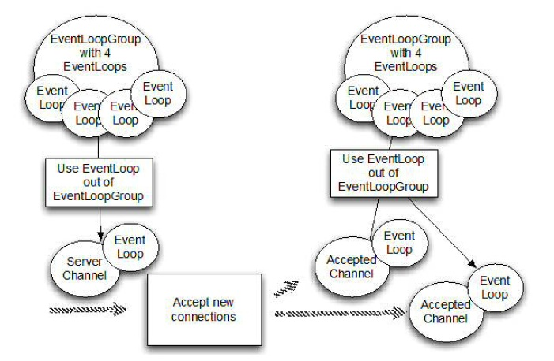
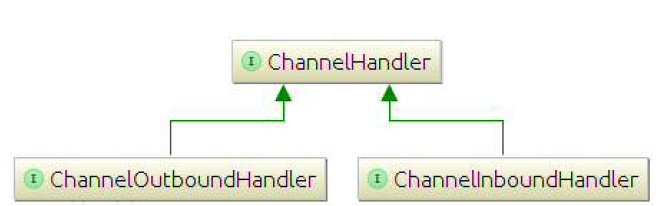

# netty

## 介绍

Netty是一个广泛使用的Java网络编程框架。它活跃和成长于用户社区。
* 优点
    * 针对多种传输类型的统一接口-阻塞和非阻塞
    * 简单但更强大的线程模型
    * 真正的无连接的数据包套接字支持
    * 连接逻辑支持复用
* 易用性
    * 大量的 Javadoc 和 代码实例
    * 除了在 JDK 1.6 + 额外的限制。（一些特征是只支持在Java
    * 1.7 +。可选的功能可能有额外的限制。）
* 性能
    * 比核心 Java API 更好的吞吐量，较低的延时
    * 资源消耗更少，这个得益于共享池和重用
    * 减少内存拷贝
    * 健壮性
    * 消除由于慢，快，或重载连接产生的 OutOfMemoryError
    * 消除经常发现在 NIO 在高速网络中的应用中的不公平的读/写比
* 安全
    * 完整的 SSL / TLS 和 StartTLS 的支持
    * 运行在受限的环境例如 Applet 或 OSGI
    * 社区
    * 发布的更早和更频繁
    * 社区驱动

## 构成部分

### Channel 

channel是NIO 基本的结构。它代表一个用于连接到实体如硬件设备、文件、网络套接字或程序组件，能过执行一个或多个不同的的I/O操作（例如读或写）的开放连接

### Callback（回调）

callback是一个简单的方法，提供给另一个方法作为引用，这样后者就可以在某个合适的时间调用前者。最常见的方法之一通知给其它人操作已完成。

Netty内部使用回调处理事件时，一旦这样的回调被触发，事件可以由接口ChannelHandler的实现来处理。如下面的代码，一旦一个新的连接建立了，调用channelActive()，并将打印一条消息。

~~~java
import io.netty.channel.ChannelInboundHandlerAdapter;
public class ConnectHandler extends ChannelInboundHandlerAdapter {
    @Override
    public void channelActive(ChannelHandlerContext ctx) throws Exception {
        System.out.println("client "+ctx.channel().remoteAddress()+" connected");
    }
}
~~~

### Future

Future提供了另外一种通知应用操作已完成的方法，这个对象作为一个异步操作接口的占位符，它将在 未来的某个时候完成并提供结果。

ChannelFuture 提供多个附件方法来允许一个或多个`ChannelFutureListener`实例，这个回调方法 operationComplete
()会在操作完成时调用，时间监听者能过确认这个操作是否成功或者是错误。如果是后者，我们可以检索到产生的Throwable。简而言之，`ChannelFutureListener` 提供的通知机制不需要手动检查操作是否完成的。

每个Netty的 outbound I/O 操作都会返回一个ChannelFuture，这样就不会阻塞。这就是Netty所谓的"自底向上的异步和事件驱动"。

~~~java
Channel channel = ...;
// 不会阻塞
ChannelFuture future = channel.connect(new InetSocketAddress("192.168.0.1",25);
~~~

下面代码描述了如何利用ChannelFutureListener。首先，连接到远程地址。接着，通过`ChannelFuture`调用connect()来注册一个新`ChannelFutureListener
`。当监听器被通知连接成功，我们检查状态。如果是成功，就写数据到channel，否则我们检索ChannelFuture中的Throwable

~~~java
Channel channel = ...;
// 不会阻塞
ChannelFuture future = channel.connect(new InetSocketAddress("192.168.0.1",25));    // 1
future.addListener(new ChannelFutureListener() {    // 2
    @Override
    if(future.isSuccess()) {    // 3
        ByteBuf buffer = Unpooled.copiedBuffer(
        "Hello",Charset.defaultCharset());  // 4
        ChannelFuture wf = future.channel().writeAndFlush(buffer);  // 5
        // ... 
    }else {
        Throwable cause = future.cause();   // 6
        cause.printStackTrace();
    }
})
~~~

1. 异步连接到远程对等节点。调用立即返回并提供 `ChannelFuture`
2. 操作完成后通知注册一个 `ChannelFutureListener`
3. 当operationComplete()调用检查操作的状态
4. 如果成功就创建一个`ByteBuf`来保存数据
5. 异步发送数据到远程。再次返回ChannelFuture
6. 如果有一个错误则抛出Throwable，描述错误原因

### Event 和 Handler

Netty 使用不同的事件来通知我们更改的状态或操作的状态。这是我们能够根据发生的事件来触发适当的行为。
这些行为可能包括：

* 日志
* 数据转换
* 流控制
* 应用程序逻辑 

由于 Netty 是一个网络框架，时间很清晰的跟入站和出站数据流相关。因为一些事件可能触发传入的数据或状态的变化包括：

* 活动或非活动连接
* 数据的读取
* 用户事件
* 错误****

出站事件是由于在未来操作将触发一个动作。这些包括：

* 打开或关闭一个连接到远程
* 写或冲刷数据到Socket

每个事件都可以分配给用户实现处理程序类的方法。这说明事件驱动的范例可直接转换为应用程序构建块。

Netty 的 `ChannelHandler` 是各种处理程序的基本抽象。想象下，每个处理器实例就是一个回调，用于执行各种事件的响应。

在此基础上，Netty也提供一组丰富预定义的处理程序，开箱即用。比如：各种协议的编码解码器包括HTTP和SSL/TLS。在内部，ChannelHandler使用事件和future本身，,创建具有 Netty 特性抽象的消费者。

### 整合 FUTURE,CALLBACK和HANDLER

Netty 的异步编程模型是建立在future和callback的概念上的。所有这些元素的协同为自己的设计提供强大的力量。

拦截操作和转换入站或出站数据只需要提供回调或利用future操作返回的。这使得链操作简单、高效,促进编写可重用的、通用的代码。

### SELECTOR,EVENT 和 EVENT LOOP

Netty 通过触发事件从应用程序中抽象出Selector，从而避免手写调度代码，EventLoop分配给每个Channel来处理所有的事件，包括
* 注册感兴趣的事件
* 调度事件到ChannelHandler
* 安排进一步行动

该 EventLoop 本身只有一个线程驱动，它给一个Channel处理所有的I/O事件，并且在EventLoop的生命周期内不会改变。这个简单而强大的线程模型消除你可能对你的 ChannelHandler 同步的任何关注，这样你就可以专注于提供正确的回调逻辑来执行。该 API 是简单和紧凑。

## API

### ChannelInboundAdapter

~~~java
// 需要覆盖的 方法
channelRead() // 每个信息入站都会调用
channelReadComplete() // 通知处理器最后的channelRead()是当前批处理中的最后一条消息调用
exceptionCaught() // 读操作时捕获异常时调用
~~~

每个Channel都有一个关联的ChannelPipeline，它代了ChannelHandler实例的链。适配器的实现只是将一个处理方法调用转发到链中的下一个处理器。

关键点：
* `ChannelHandler`是给不同类型的事件调用
* 应用程序实现或扩展`ChannelHandler`挂接到事件生命周期和提供自定义应用逻辑。

### BOOTSTRAP

Netty 应用程序通过设置bootstrap（引导）类的开始，该类提供一个用于应用程序网络配置的容器

### CHANNEL

底层网络传输API必须提供给应用I/O操作的接口，如读，写，连接，绑定等等。这些结构几乎总是会成为一个"socket"。Netty中的接口Channel定义了与socket丰富交互的操作集：bind,close,config
,connect,isActive,isOpen,isWritable,read,write等等。Netty提供大量的Channel实现来专门使用。这些包括AbstractChannel,AbstractNioByteChannel,AbstractNioChannel,EmbeddedChannel,LocalServerChannel,NioSocketChannel等等

### CHANNEL_HANDLER

channelHandler支持很多协议，并且提供由于数据处理的容器,ChannelHandler有特定事件触发。ChannelHandler可专门用于几乎所有的动作，包括将一个对象转为字节（或相反），执行过程中抛出异常处理。

常用的一个接口是ChannelInboundHandler，这个类型接收到入站事件（包括接收到的数据）可以处理应用程序逻辑。当需要提供响应时，你也可以从ChannelInboundHandler冲刷数据。

### CHANNEL_PIPELINE

ChannelPipeline 提供了一个容器给ChannelHandler链并提供了一个API用于管理沿着链 入站和出站事件的流动。每个Channel都有自己的ChannelPipeline，当Channel
创建时自动创建的。ChannelHandler是如何安装在ChannelPipeline？主要是实现了ChannelHandler的抽象ChannelInitializer。ChannelInitializer
子类通过ServerBootStrap进行注册。当它的方法initChannel()被调用时，这个对象将安装自定义的ChannelHandler集到pipeline。当这个操作完成时，ChannelInitializer
子类则从ChannelPipeline自动删除自身。

### EVENT LOOP

EventLoop 用于处理Channel的I/O操作，一个单一的EventLoop通常会处理多个Channel事件。一个EventLoopGroup可以含有多于一个的EventLoop和提供一种迭代用于检索清单的下一个。

### CHANNEL FUTURE

Netty所有的I/O操作都是异步。因为一个操作可能无法立即返回，我们需要有一种其它方法在以后确定它的结果。处于这个目的，Netty提供了接口。ChannelFuture,它的addListener
方法注册了一个ChannelFutureListener，当操作完成时，可以被通知（不管成功与否）。

_想想一个 ChannelFuture 对象作为一个未来执行操作结果的占位符。何时执行取决于几个因素，因此不可能预测与精确。但我们可以肯定的是，它会被执行。此外，所有的操作返回 ChannelFuture 对象和属于同一个 Channel 将在以正确的顺序被执行，在他们被调用后。_

## Channel,Event和I/O

Netty是同一个非阻塞、事件驱动的网络框架。Netty实际上是使用Threads（多线程）处理I/O事件。Netty设计保证程序处理事件不会有同步 。

!()[images/Figure 3.1.jpg]

该图显示，一个EventLoopGroup具有一个或多个EvenLoop。想象EventLoop作为一个Thread给Channel执行工作。

当创建一个Channel,Netty通过一个单独的EventLoop实例来注册该Channel（并同样是一个单独的Thread）的通道使用寿命。所有的Channel的I/O始终用相同的线程来执行。

## Bootstrapping

Bootstrapping(引导)是Netty中配置程序的过程，当你需要连接客户端或服务器绑定指定短空时需要使用Bootstrapping。

Bootstrapping有两种类型，一种是用于客户端的Bootstrap,一种是用于服务端的ServerBootstrap。不管程序使用哪种协议，无论是创建一个客户端还是服务器都需要使用“引导”。

_面向连接 vs. 无连接_

面向连接是适用于TCP协议，这样协议保证该连接的端口之间的消息的有序输送。无连接协议发送的消息，无法保证顺序和成功性。

两种Bootstrapping之间有一些相似之处，也有一些不同。Bootstrap和ServerBootstrap之间的差异如下：

| 分类               | Bootstrap            | ServerBootstrap |
| ------------------ | -------------------- | --------------- |
| 网络功能           | 连接到远程主机和端口 | 绑定本地端口    |
| EventLoopGroup数量 | 1                    | 2               |

Bootstrap用来连接远程主机，有1个EventLoopGroup

ServerBootstrap用来绑定本地端口，有2个EventLoopGroup

ServerBootstrap监听在服务器监听一个端口轮询客户端的Bootstrap或DatagramChannel是否连接服务器，通常需要Bootstrao类的connect()方法，但是也可以先调用bind()或再调用connect()进行连接，之后使用Channel包含在bind()返回的ChannelFuture红。

一个ServerBootstrap可以认为有2个Channel集合，一个集合包含一个单例ServerChannel，代表持有一个绑定了本地端口的socket。第二集合包含所有创建的Channel，处理服务器所接收到的客户端进来的连接 。

与ServerChannel相关EventLoopGroup分配一个EventLoop是负责创建Channels用于传入的连接请求 。一旦连接接受，第二个EventLoopGroup分配一个EventLoop给它的Channel。

## ChannelHandler和ChannelPipeline

ChannelPipe是ChannelHandler链的容器。

ChannelHandler最好是它当作一个通用的容器，处理进来的事件（包括数据）并且通过ChannelPipeline。

Netty中有两个方向的数据流，图片显示的入站（ChannelInboundHandler）和出现（ChannelOutboundHandler）之间有一个明显的区别；若数据是从用户程序到远程主机则是“出站(outbound
)”，相反若数据从远程主机到用户应用程序则是“入站(inbound)”

为了使数据从一端到达另一端，一个或多个ChannelHandler将以某种方式操作数据。这些ChannelHandler会在程序的“引导”阶段被添加(addLast())ChannelPipeline中，并且被添加的顺序将决定处理数据的顺序。

同样展示 进站和出站的处理都可以安装在相同的pipeline。本例子中，如果消息或任何其它入站事件被读到，将从pipeline头部开始，传递到第一个ChannelInboundHandler
。该处理可能会或可能不会实际修改数据，取决于其特定的功能，在这之后该数据将被传递到链中的下一个ChannelInboundHandler。最后，将数据到达pipeline的尾部，此时所有处理结束。

数据的出站运动（即，数据被“写入”）在概念上是相同的。在这种情况下的数据从尾部流过ChannelOutBoundHandlers的链，直到它到达头部。超过这点，出站数据将到达的网络传输，在这里显示为一个socket。通常这将触发一个写入操作。

_更多 Inbound、outbound Handler_

_在当前链（chain)中，事件可以通过ChannelHandlerContext传递给下一个handler。Netty为此提供了抽象基类ChannelInboundHandlerAdapter
和ChannelOutboundHandlerAdapter，用来处理你想要的事件。这些类提供的方法的实现，可以简单地通过调用ChannelHandlerContext上的相应方法将事件传递给下一个handler。_

所以，如果出站和入站操作是不同的，当ChannelPipeline中有混合处理器时将发生什么？虽然入站和出站处理器都扩展了ChannelHandler，Netty的ChannelInboundHandler
的实现和ChannelHandlerContext，Netty的ChannelInboundHandler的实现和ChannelOutboundHandler
之间是有区别的，从而保证数据传递只从一个处理器到下一个处理器到下一个处理器保证正确的类型。

当ChannelHandlerContext，它代表一个ChannelHandler和ChannelPipeline之间的“绑定”。它通常是安全保存对此对象的引用，除了当协议中的使用的是不面向连接（UDP
）。而该对象可以用来获得底层Channel，它主要是用来写 出站数据。

还有，实际上，在Netty发送消息两种方式。可以直接写消息给Channel或写入ChannelHandlerContext对象。主要的区别是，前一种消息会 导致从ChannelPipeline的尾部开始，而后者导致消息从ChannelPipeline下一个处理器开始。

## ChannelHanlder

_适配器_

经常的适配器：ChannelHandlerAdapter、ChannelInboundHandlerAdapter、ChannelOutboundHandlerAdapter、ChannelDuplexHandlerAdapter

### 编码器、解码器

当发送或接收消息时，Netty数据转换就发生了。入站消息将从字节转为一个Java对象时；也就是“解码”。如果该消息是出站相反会发生：“编码”，从一个Java对象转为字节。其原因很简单的：网络数据就是一系列的字节，因此需要存在类型转换。

不同类型的抽象类用于提供编码器和解码器的，这取决于手头的任务。例如，应用程序可能并不需要马上将消息转为字节。相反，该​​消息将被转换一些其他格式。一个编码器将仍然可以使用，但它也将衍生自不同的超类，

在一般情况下，基类将有一个名字类似 ByteToMessageDecoder 或MessageToByteEncoder。在一种特殊类型的情况下，你可能会发现类似ProtobufEncoder 和 ProtobufDecoder，用于支持谷歌的 protocol buffer。

严格地说，其他处理器可以做编码器和解码器能做的事。但正如适配器类简化创建通道处理器，所有的编码器/解码器适配器类 都实现自 ChannelInboundHandler 或 ChannelOutboundHandler。

对于入站数据，channelRead 方法/事件被覆盖。这种方法在每个消息从入站 Channel 读入时调用。该方法将调用特定解码器的“解码”方法，并将解码后的消息转发到管道中下个的 ChannelInboundHandler。

出站消息是类似的。编码器将消息转为字节，转发到下个的 ChannelOutboundHandler。

### SimpleChannelHandler

也许最常见的处理器是接收到解码后的消息并应用一些业务逻辑到这些数据。要创建这样一个 ChannelHandler，你只需要扩展基类SimpleChannelInboundHandler 其中 T 是想要进行处理的类型。这样的处理器，你将覆盖基类的一个或多个方法，将获得被作为输入参数传递所有方法的 ChannelHandlerContext 的引用。

在这种类型的处理器方法中的最重要是 channelRead0(ChannelHandlerContext，T)。在这个调用中，T 是将要处理的消息。

_阻塞操作_

_I/O 线程一定不能完全阻塞，因此禁止任何直接阻塞操作在你的 ChannelHandler， 有一种方法来实现这一要求。你可以指定一个 EventExecutorGroup 当添加 ChannelHandler 到ChannelPipeline。此 EventExecutorGroup 将用于获得EventExecutor，将执行所有的 ChannelHandler 的方法。这EventExecutor 将从 I/O 线程使用不同的线程，从而释放EventLoop。_

## Transport

* NIO
* OIO
* Local(本地)
* Embedded(内嵌)

网络应用程序提供了人与系统通信的通道，但是，当然，他们也将大量的数据从一个地方转移到另一个地方。如何做到这一点取决于具体的网络传输，但转移始终是相同的：字节通过线路。传输的概念帮助我们抽象掉的底层数据转移的机制。我们只需要知道的是，字节在被发送和接收。

### Transport API

Transport API的核心是Channel接口，用于所有的出站操作。

每个Channel都会分配一个ChannelPipeline和ChannelConfig。ChannelConfig负责设置并存储Channel的配置，并允许在运行期间更新它们。传输一般有特定的配置设置，可能实现了ChannelConfig的子类型。

ChannelPipeline容纳了使用的ChannelHandler实例，这些ChannelHandler将处理通道传递的“入站”和“出站“数据以及事件。ChannelHandler的实现允许改变数据状态和传输数据。

可以使用 ChannelHandler 做下面一些事情：
* 传输数据时，将数据从一种格式转换到另一种格式
* 异常通知
* Channel变为active(活动)或inactive(非活动)时获得通知* Channel被注册或注销时从EventLoop中获得通知
* 通知用户特定事件

_Interception Filter（拦截过滤器）_

_ChannelPipeline实现了常用的Intercepting Filter（拦截过滤器）设计模式。UNIX管道是另一例子：命令链接在一起，一个命令的输出连接到下一行的输入。

Channel main methods

| 方法名称               | 描述            |
| ------------------ | -------------------- |
| eventLoop()           | 返回分配给Channel的EventLoop |
| pipeline() | 返回分配给Channel的ChannelPipeline                    |
| isActive() | 返回Channel是否激活，已激活说明与远程连接对等 |
| localAddress() | 返回已绑定的本地SocketAddress |
| remoteAddress() | 返回已绑定的远程SocketAddress |
| write() | 写数据到远程客户端，数据通过ChannelPipeline传输过去 |
| flush() | 刷新先前的数据 |
| writeAndFlush(...) | 一个方便的方法用户调用write(...)后调用flush |

~~~java
Channel channel= ...;// 获取channel的引用
ByteBuf buf = Unpooled.copiedBuffer("your data",CharsetUtil.UTF_8);
ChannelFuture cf = channel.writeAndFlush(buf);

cf.addListener (new ChannelFutureListener(){
    @Override
    public void operationComplete(ChannelFuture future) {
     	if (future.isSuccess()) {               
            System.out.println("Write successful");
        } else {
            System.err.println("Write error");    
            future.cause().printStackTrace();
        }
    }
});
~~~

~~~java
final Channel channel = ...;    // 获取channel的引用
final ByteBuf buf = Unpooled.copiedBuffer("your data", CharsetUtil.UTF_8).retian();

Runnable writer = new Runnable(){
    @Override
    public void run() {
        channel.writeAndFlush(buf.duplicate());        
    }
};

Executor executor = Executors.newCachedThreadPool();

// 写进一个线程
executor.execute(write);

// 写进另外一个线程
executor.execute(write);
~~~

### Netty包含的Transport

Netty自带了一些传输协议的实现，Netty应用程序的传输协议依赖于底层协议。

Netty中的传输方式有如下几种：

| 方法名称 | 包                          | 描述                                                         |
| -------- | --------------------------- | ------------------------------------------------------------ |
| NIO      | io.netty.channel.socket.nio | 基于java.nio.channels的工具包，使用选择器作为基础的方法      |
| OIO      | io.netty.channel.socket.oio | 基于java.net的工具包，使用阻塞流                             |
| local    | io.netty.channel.local      | 用来在虚拟机之间本地通信                                     |
| Embedded | io.netty.channel.embedded   | 嵌入传输，它允许在没有真正网络的传输中使用ChannelHandler，可以非常有用的来测试ChannelHandler的实现。 |

**NIO-NonBlocking I/O**

NIO传输是目前最常用的方式，它通过使用选择器提供了完全异步的方式操作所有的I/O，NIO从Java 1.4才被提供。

NIO中，我们可以注册一个通道或某个通道的改变的状态，通道状态有下面几种改变：

* 一个新的Channel被接受并已准备好
* Channel连接完成
* Channel中有数据并已准备好读取
* Channel发送数据出去

处理完改变的状态后重新设置它们的状态，用一个线程来检查是否已准备好的Channel，如果有则执行相关事件。在这里可能只同时一个注册的事件而忽略其他的。选择器所支持的操作在SelectionKey中定义，具体如下：

| 方法名称   | 描述                                     |
| ---------- | ---------------------------------------- |
| OP_ACCEPT  | 有新连接得到通知                         |
| OP_CONNECT | 连接完成后得到通知                       |
| OP_READ    | 准备好读取数据时得到通知                 |
| OP_WRITE   | 写入更多数据到通道时得到通知，大部分时间 |

