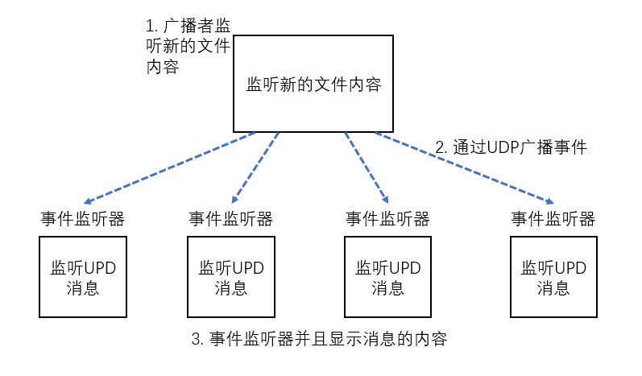

### 13.1 UDP的基本知识

面向连接的传输（如TCP）管理了两个网络断点之间的来连接的建立，在 连接的生命周期内的有序和可靠的消息传输，以及最后，连接的有序终止。

UDP是无连接协议，并没有持久化连接的概念，并且每一个消息（一个UDP数据报）都是一个单独的传输单元。

UDP也没有TCP的纠错机制，其中每个节点都将确认 它们所接收到的包，而没有被确认的包将会被发送方重新传输。

UDP很适合哪些能过处理或者容忍消息丢失的应用程序，但可能不适合那些处理金融交易的应用程序。

### 13.2 UDP广播

UDP提供了向多个接收者发送消息的额外传输模式：

* 多播——传输到一个预定义的主机组
* 广播——传输到网络（或者子网）上的所有主机

~~~java
// LogEvent
public final class LogEvent{
    public static final byte SEPARATOR = (byte)':';
    private final InetSocketAddress source;
    private final String logfile;
    private final String msg;
    private final long received;
    
    
    public LogEvent(String logfile,Strig msg){
        this(null,-1,logfile,msg);
    }
    
    
    public LogEvent(InetSocketAddress source,long received,String logfile,String msg){
        this.source = source;
        this.logfile= logfile;
        this.msg = msg;
        this.received = received;
    }
    
    public InetSocketAddress getSource(){
        return source;
    }
    
    getter...
}
~~~

## 13.5 编写广播者

Netty提供了大量的类来支持UDP应用程序的编写

| 名称                                                         | 描述                                                         |
| ------------------------------------------------------------ | ------------------------------------------------------------ |
| interface AddressedEnvelope<M,A extends SocketAddress> extends ReferenceCounted | 定义一个消息，其包装了另一个消息并带有发送者和接收者值。其中M是消息类型；A是地址类型 |
| class DefaultAddressedEnvelope<M,A extends SocketAddress> implements AddressedEnvelope<M,A> | 提供了interface AddressedEnvelope的默认实现                  |
| class DatagramPacket extends DefaultAddressedEnvelope<ByteBuf,InetSocketAddress> implements ByteBufHolder | 扩展了DefaultAddressedEnvelope以使用ByteBuf作为消息容器      |
| interface DatagramChannel extends Channel                    | 扩展Netty的Channel抽象以支持UDP的多播组管理                  |
| class NioDatagramChannel extends AbstractNioMessageChannel implements DatagramChannel | 定义了一个能发送和接收AddressedEnvelope消息的Channel类型     |

Netty的DatagramPacket是一个简单的消息容器，DatagramChannel实现用它来和远程节点通信。