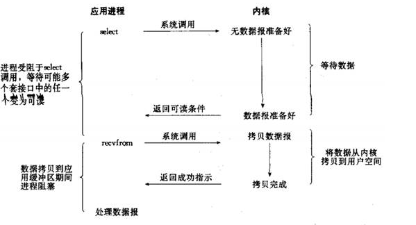
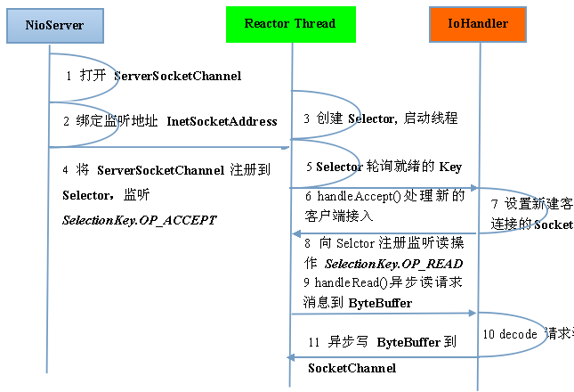
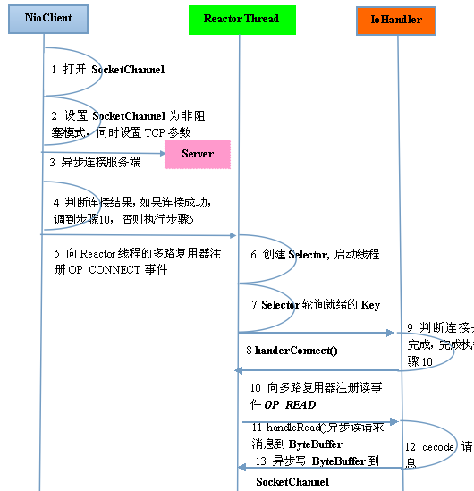

## 1. Netty简介

Netty 是一个高性能、异步事件驱动的 NIO 框架，它提供了对 TCP、UDP 和文件传输的支持，作为一个异步 NIO 框架，Netty 的所有 IO 操作都是异步非阻塞的，通过 Future-Listener 机制，用户可以方便的主动获取或者通过通知机制获得 IO 操作结果。

## 2. Netty 高性能之道

### 2.1 RPC调用的性能分析

#### 2.1.1 传统RPC调用性能差

##### IO模型问题

网络传输方式问题：传统的 RPC 框架或者基于 RMI 等方式的远程服务（过程）调用采用了同步阻塞 IO，当客户端的并发压力或者网络时延增大之后，同步阻塞 IO 会由于频繁的 wait 导致 IO 线程经常性的阻塞，由于线程无法高效的工作，IO 处理能力自然下降。

采用 BIO 通信模型的服务端，通常由一个独立的 Acceptor 线程负责监听客户端的连接，接收到客户端连接之后为客户端连接创建一个新的线程处理请求消息，处理完成之后，返回应答消息给客户端，线程销毁，这就是典型的一请求一应答模型。该架构最大的问题就是不具备弹性伸缩能力，当并发访问量增加后，服务端的线程个数和并发访问数成线性正比，由于线程是 JAVA 虚拟机非常宝贵的系统资源，当线程数膨胀之后，系统的性能急剧下降，随着并发量的继续增加，可能会发生句柄溢出、线程堆栈溢出等问题，并导致服务器最终宕机。

线程模型问题：由于采用同步阻塞 IO，这会导致每个 TCP 连接都占用 1 个线程，由于线程资源是 JVM 虚拟机非常宝贵的资源，当 IO 读写阻塞导致线程无法及时释放时，会导致系统性能急剧下降，严重的甚至会导致虚拟机无法创建新的线程。

###### 1. 序列化问题

1. Java序列化机制是Java内部的一种对象编码解码技术，无法跨语言使用。例如对于异构系统之间的对接，Java 序列化后的码流需要能够通过其它语言反序列化成原始对象（副本），目前很难支持；

2. 资源开销大

3. 序列化性能差（CPU资源占用高）

##### 高性能的三个主题

1. 传输：用什么样的通道将数据发送给对方，BIO、NIO 或者 AIO，IO 模型在很大程度上决定了框架的性能。

2. 协议：采用什么样的通信协议，HTTP 或者内部私有协议。协议的选择不同，性能模型也不同。相比于公有协议，内部私有协议的性能通常可以被设计的更优。

3. 线程：数据报如何读取？读取之后的编解码在哪个线程进行，编解码后的消息如何派发，Reactor 线程模型的不同，对性能的影响也非常大。

#### 2.2.1 异步非阻塞通信

在 IO 编程过程中，当需要同时处理多个客户端接入请求时，可以利用多线程或者 IO 多路复用技术进行处理。IO 多路复用技术通过把多个 IO 的阻塞复用到同一个 select 的阻塞上，从而使得系统在单线程的情况下可以同时处理多个客户端请求。与传统的多线程 / 多进程模型比，I/O 多路复用的最大优势是系统开销小，系统不需要创建新的额外进程或者线程，也不需要维护这些进程和线程的运行，降低了系统的维护工作量，节省了系统资源。

JDK1.4 提供了对非阻塞 IO（NIO）的支持，JDK1.5_update10 版本使用 epoll 替代了传统的 select/poll，极大的提升了 NIO 通信的性能。

NIO 服务器端通信序列图

NIO客户端通信序列图

Netty的 IO 线程NioEventLoop由于聚合了多路复用器Selector，可以同时并发处理成百上千个客户端 Channel，由于读写操作都是非阻塞的，这就可以充分提升 IO 线程的运行效率，避免由于频繁 IO 阻塞的线程挂起。

Netty也采用了异步通信模式，一个 IO 线程可以并发处理 N 个客户端连接和读写操作，这从根本上解决了传统同步阻塞 IO 一连接一线程模型，架构的性能、弹性伸缩能力和可靠性都得到了极大的提升。

#### 2.2.2 零拷贝

Netty的“零拷贝”主要体现在三个方面：

1. Netty的接收和发送 ByteBuf 采用 DIRECT BUFFERS，使用堆外内存进行 Socket 读写，不需要进行字节缓冲区的 二次拷贝。如果使用传统的堆内存（HEAP BUFFERS）进行Socket读写，JVM
会将堆内存Buffer 拷贝一份到直接内存，然后才写入Socket中。相比于堆外内存，消息在发送过程中多了一次缓冲区的内存拷贝。

2. Netty提供了组合 Buffer 对象，可以聚合多个ByteBuf对象，用户可以像操作一个 Buffer 那样方便的对组合 Buffer 进行操作，避免了传统通过内存拷贝的方式将几个小 Buffer 合并成一个大 Buffer、

3. Netty文件传输采用了 transferTo 方法，它可以直接将文件缓冲区的数据发送到目标 Channel，避免了传统通过 while 循环的方式导致 的内存拷贝问题。

1) ByteBufAllocator 通过 ioBuffer 分配堆外内存

当进行Socket IO 读写的时候，为了避免从堆外内存拷贝一份副本到直接内存，Netty的 ByteBuf 分配其直接创建非堆内存避免缓冲区的二次拷贝，通过“零拷贝”来提升读写性能。

2) CompositeByteBuf，它对将多个 ByteBuf 封装成一个 ByteBuf，对外提供一封装后的 ByteBuf 接口。

3) Netty 文件传输 DefaultFileRegion 通过 transferTo 方法将文件发送到目标 Channel 中