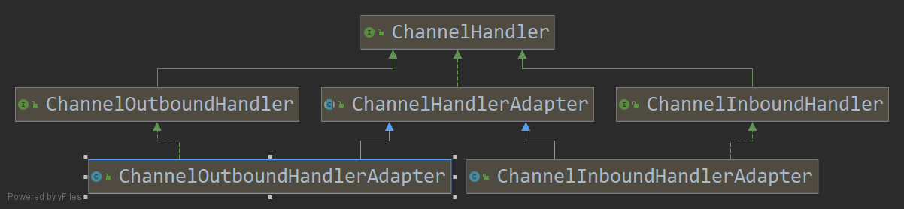
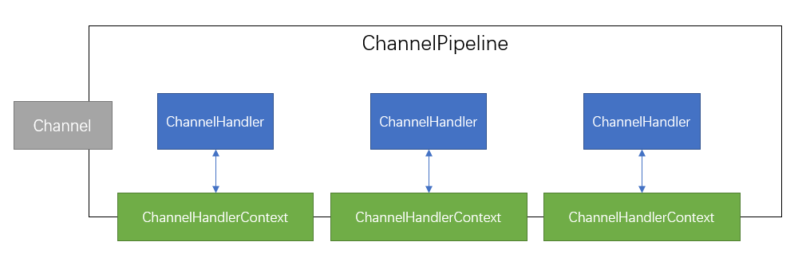

## 6.1 ChannelHandler 家族

### 6.1.1 Channel的生命周期

Interface Channel 定义了一组和ChannelInboundHandler API 密切相关的简单但功能强大的状态模型，

| 状态                | 描述                                                         |
| ------------------- | ------------------------------------------------------------ |
| ChannelUnregistered | Channel已经被创建，但还未注册到EventLoop                     |
| ChannelRegistered   | Channel已经被注册到了EventLoop                               |
| ChannelActive       | Channel处于活动状态（已经连接到它的远程节点）。它现在可以接收和发送数据了。 |
| ChannelInactive     | Channel没有连接到远程节点                                    |

当状态发生改变时，将会生成对应的事件。这些事件将会转发给ChannelPipeline中的ChannelHandler。

### 6.1.2 ChannelHandler的生命周期

interface ChannelHandler定义的生命周期操作，在ChannelHandler被添加到ChannelPipeline中或者从ChannelPipeline中移除时会调用这些操作。这个方法中都接受一个ChannelHandlerContext参数。

| 类型            | 描述                                              |
| --------------- | ------------------------------------------------- |
| handlerAdded    | 当把ChannelHandler添加到ChannelPipeline中时被调用 |
| handlerRemoved  | 当从ChannelHandler中移除ChannelPipeline时被调用   |
| exceptionCaught | 当处理过程中在ChannelPipeline中有错误产生时被调用 |

ChannelHandler子接口：

* ChannelInboundHandler——处理入站数据以及各种状态变化
* ChannelOutboundHandler——处理出站数据并且允许拦截所有的操作

### 6.1.3 ChannelInboundHandler接口

| 类型                         | 描述                                                         |
| ---------------------------- | ------------------------------------------------------------ |
| channelRegistered            | 当Channel已经 注册到它的EventLoop并且能够处理I/O时被调用     |
| channelUnregsitered          | 当Channel从它的EventLoop注销并且无法处理任何I/O时被调用      |
| channelActive                | 当Channel处于活动状态时被调用，Channel已经连接/绑定并且已经就绪 |
| channelInactive              | 当Channel离开活动状态并且不再连接它的远程节点时被调用        |
| channelReadComplete          | 当Channel上的一个读操作完成时被调用                          |
| channelRead                  | 当从Channel读取数据时被调用                                  |
| channelWriteableilityChanged | 当Channel的可写状态发生改变时 被调用。用户可以确保写操作不会完成得太快（以避免发生OutOfMemoryError）或者可以在Channel变为再次可写时回复写入。可以通过调用Channel的isWriteable()方法来检测Channel的可写性。与可写性相比的阈值可以通过Channel.config().setWriteHighWaterMark()和Channel.config().setWriteLowWaterMark()方法来设置 |
| userEventTriggered           | 当ChannelInboundHandler.fireUserEventTriggered ()方法调用时被调用，因为一个POJO被传进了ChannelPipeline |

当某个ChannelInboundHandler的实现重写了channelRead()方法时，它将负责显示释放与池化与ByteBuf实例相关的内存。Netty提供了一个实用的方法ReferenceCountUtil.release()

### 6.1.4 ChannelOutboundHandler接口

出站操作和数据将由ChannelOutboundHandler处理。它的方法将被Channel、ChannelPipeline以及ChannelHandlerContext调用。

ChannelOutboundHandler的一个强大的功能是 可以 按需 推迟 操作或者事件。

| 类型                                                        | 描述                                              |
| ----------------------------------------------------------- | ------------------------------------------------- |
| bind(ChannelHandlerContext,SocketAddress,ChannelPromise)    | 当请求将Channel绑定到本地地址时被调用             |
| connect(ChannelHandlerContext,SocketAddress,ChannelPromise) | 当请求将Channel连接 到远程节点时被调用            |
| disconnect(ChannelHandlerContext,ChannelPromise)            | 当请求将Channel从远程节点断开时被调用             |
| close(ChannelHandlerContext,ChannelPromise)                 | 当请求关闭Channel时被调用                         |
| deregister(ChannelHandlerContext,ChannelPromise)            | 当请求将Channel从它的EventLoop注销时被调用        |
| read(ChannelHandlerContext)                                 | 当请求从Channel读取更多的数据时被调用             |
| flush(ChannelHandlerContext)                                | 当请求通过Channel将入队数据冲刷到远程节点时被调用 |
| write(ChannelHandlerContext,Object,ChannelPromise)          | 当请求通过Channel将数据写到远程节点时被调用       |

> **ChannelPromise**与**ChannelFuture** ChannelOutboundHandler中大部分方法都需要一个ChannelPromise参数，以便在操作完成时得到通知。ChannelPromise是ChannelFuture的一个子类，其定义了一些可写的方法，如setSuccess()和setFailure()，从而使ChannelFuture不可变。

### 6.1.5 ChannelHandler 适配器

ChannelHandlerAdapter提供了isSharable()。如果其对应的实现被标注为Sharable，那么这个方法可以将返回true，表示它可以被添加到多个ChannelPipeline中。

### 6.1.6 资源管理

~~~java
@Sharable
public class DiscarInboundHanlder extends ChannelInboundHandlerAdapter {
    @Override
    public void channelRead(ChannelHandlerContext ctx,Object msg){
        ReferenceCountUtil.release(msg);	// 调用ReferenceCountUtil.release()
    }
}
~~~

~~~java
@Sharable
public class DiscardOutboundHandler extends ChannelOutboundHandlerAdapter{
    @Override
    public void write(ChannelHandlerContext ctx,Object msg,Object msg,ChannelPromise promise){
        ReferenceCountUtil.release(msg);
        promise.setSuccess();
    }
}
~~~

## 6.2 ChannelPipeline 接口

## 6.3 ChannelHandlerContext 接口

ChannelHandlerContext代表了ChannelHandler和ChannelPipeline之间的关联，每当有ChannelHandler添加到ChannelPipeline中，都会创建ChannelHanlderContext。ChannelHandlerContext主要用来管理它 所关联的ChannelHandler和在同一个ChannelPipeline中的其它ChannelHandler之间的交互。

**ChannelHandlerContext API**

| 方法名称                      | 描述                                                         |
| ----------------------------- | ------------------------------------------------------------ |
| alloc                         | 返回和这个实例相关联的Channel所配置的ByteBufAllocator        |
| bind                          | 绑定到给定的SocketAddress，并返回ChannelFuture               |
| channel                       | 返回绑定到这个实例的Channel                                  |
| close                         | 关闭channel，并返回ChannelFuture                             |
| connect                       | 连接给定的SocketAddress，并返回ChannelFuture                 |
| deregister                    | 从之前给定的SocketAddress，并返回ChannelFuture               |
| disconnect                    | 从远程节点断开，并返回ChannelFuture                          |
| executor                      | 返回调度事件的EventExecutor                                  |
| fireChannelActive             | 触发对下一个ChannelInboundHanlder上的channelActive()方法（已连接）的调用 |
| fireChanelInactive            | 触发对下一个ChannelInboundHandler上的channelInactive()方法（已关闭）的调用 |
| fireChannelRead               | 触发对下一个ChannelInboundHandler上的channelRead()方法（已接收的消息）的调用 |
| fireChannelReadComplete       | 触发对下一个ChannelInboundHandler上的channelReadComplete()方法的调用 |
| fireChannelRegistered         | 触发对下一个ChannelInboundHandler上的channelRegistered()方法的调用 |
| fireChannelUnregistered       | 触发对下一个ChannelInboundHandler上的fireChannelUnregistered()方法的调用 |
| fireChannelWritabilityChanged | 触发对下一个ChannelInboundHandler上的fireChannelWritabilityChanged()方法的调用 |
| fireExceptionCaught           | 触发对下一个ChannelInboundHandler上的fireExceptionCaught(Throwable)方法的调用 |
| fireUserEventTriggered        | 触发对下一个ChannelInboundHandler上的fireUserEventTriggered(Object evt)方法的调用 |
| handler                       | 返回绑定到这里实例的ChannelHandler                           |
| isRemoved                     | 如果所关联额ChannelHandler已经被从ChannelPipeline中移除则返回true |
| name                          | 返回这个实例的唯一名称                                       |
| pipeline                      | 返回这个实例所关联的ChannelPipeline                          |
| read                          | 将数据从Channel读取到第一个入站缓冲区，如果读取成功则触发，一个channelRead事件。并（在最后一个消息被读取完成后）通知ChannelInboundHanlder的channelReadComplete(ChannelHandlerContext)方法。 |
| write                         | 通过 这个实例写入消息并经过ChannelPipeline                   |
| writeAndFlush                 | 通过这个实例写入并冲刷消息并经过ChannelPipeline              |

### 6.3.1 使用 ChannelHandlerContext

也可以从某个ChannelHandlerContext开始

~~~java
ChannelHandlerContext ctx = ...;
ctx.write(Unpooled.copieBuffer("hello",CharsetUtil.UTF_8));
~~~

~~~java
// 缓存到ChannelHanlderContext的引用
public class WriteHandler extends ChannelHandlerAdapter{
    private ChannelHandlerContext ctx;
    
    @Override
    public void handlerAdd(ChannelHandlerContext ctx){
        this.ctx = ctx;
    }
    
    public void send(String msg){
        ctx.writeAndFlush(msg);
    }
}
~~~

~~~java
// 可共享的 ChannelHandler
@Sharable
public class SharableHandler extends ChannelInboundHandlerAdapter{
    public void channelRead(ChannelHanlderContext ctx,Object msg){
        System.out.println("Channel read message : "+msg);
        ctx.fireChannelRead(msg);
    }
}
~~~

~~~java
// @Sharable错误的用法
public class UnsharableHandler extends ChannelInboundAdapter{
    private int count;
    
    public void channelRead(ChannelHandlerContext ctx,Object msg){
        count++;
        System.out.println("channelRead(...) called the "+ count+ " time");
        ctx.fireChannelRead(msg);
    }
}
~~~

## 6.4 异常处理

### 6.4.1 处理入站异常

~~~java
public class InboundExceptionHandler extends ChannelInboundHanlderAdapter{
    public void exceptionCaught(ChannelHandlerContext ct,Thowable cause){
        cause.printStatckTrace();
        ctx.close();
    }
}
~~~

### 6.4.2 处理出站异常

~~~java
ChannelFuture future = channel.write(someMessage);
future.addListener(new ChannelFutureListener(){
    public void operationComplete(ChannelFuture f){
        if(!f.isSuccess()){
            f.cause().printStackTrace();
            f.channel().close();
        }
    }
})
~~~

