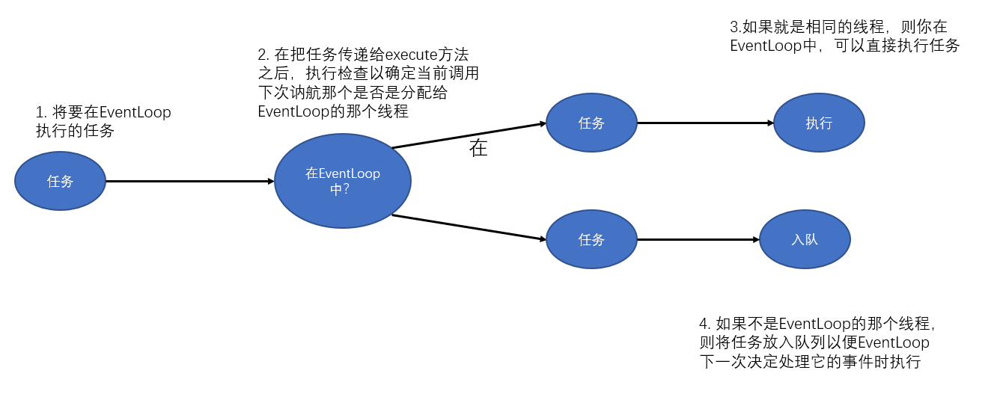

## 7.2 EventLoop 接口

~~~java
while(!terminated){
    List<Runnable> readyEvents = blockUntilEventsReady();	// 阻塞，直到有事件已经就绪可被运行
    for(Runnable ev : readyEvents){
        ev.run();
    }
}
~~~

一个EventLoop将由一个永远都不会改变的`Thread`驱动，同时 任务（Runnable和Callable）可以直接提交给EventLoop实现，以立即执行或者任务调度执行。

Netty的EventLoop在继承了ScheduledExecutorService的同时，只定义了一个方法，parent()。

~~~java
public interface EventLoop extends EventExecutor,EventLoopGroup{
    @Override
    EventLoopGroup parent();
}
~~~

> **事件/任务的执行顺序** 事件和任务都是以先进先出（FIFO）的顺序执行的。这样可以通过保证字节内容总是按正确的顺序被处理，消除潜在的数据损坏的可能性。

所有的I/O操作和事件都由已经被分配给了EventLoop的那个Thread来处理。

## 任务调度

### 7.3.1 JDK的任务调度API

在JDK1.5之前，任务调度是建立在 java.util.Timer之上。随后JDK 提供了java.util.concurrent包，它定义了interface ScheduledExecutorSerivice。

### 7.3.2 使用EventLoop调度任务

ScheduledExecutorService的实现具有局限性，例如，事实上作为线程管理的一部分，将会有额外额线程创建。如果有大量任务被紧凑地调度，那么这将成为一个瓶颈。Netty通过Channel的EventLoop实现任务调度解决这一问题。

~~~java
Channel ch = ...;
ScheduledFuture<?> future = ch.eventLoop().schedule(()->{
    System.out.println("60 seconds later");
},60,TimeUnit.SECONDS);

ScheduledFuture<?> future = ch.eventLoop().shceduleAtFiexRate(()->{
    System.out.println("60 seconds later");
},60,60,TimeUnit.SECONDS);
~~~

**取消操作**

~~~java
ScheduledFuture<?> future = ch.eventLoop().shceduleAtFiexRate(...);
// Some other code that runs...
boolean mayInterruptIfRuning = false;
future.cancel(myInterruptIfRunning);	// 取消该任务，防止它再次运行
~~~

## 7.4 Netty的实现细节

### 7.4.1 线程管理

