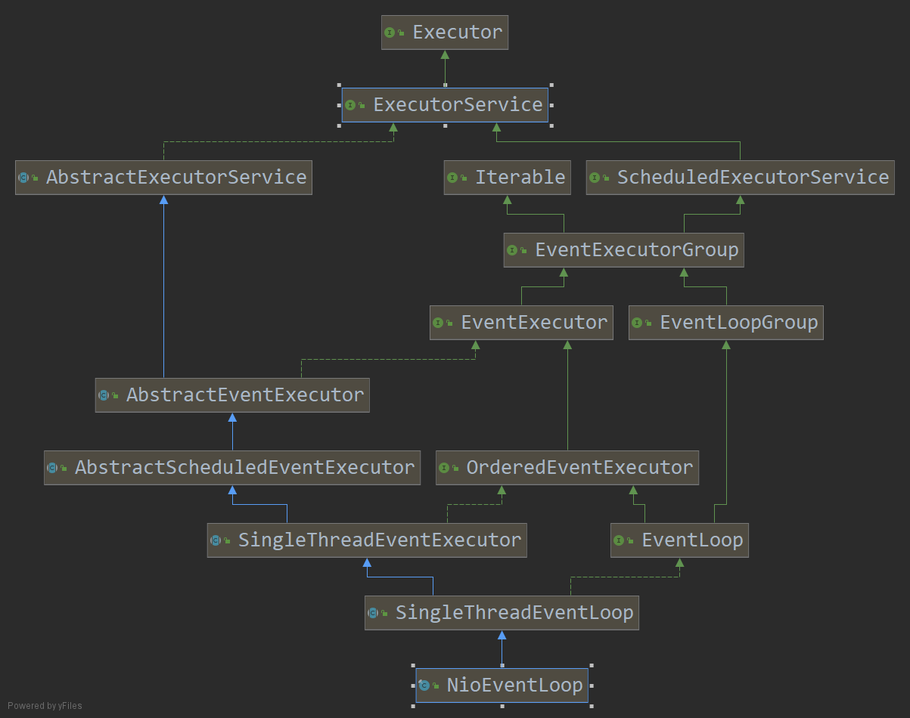

## 问题

1. 默认情况下，Netty服务器端启动多少个线程？何时启动？

2. Netty是如何解决 jdk 空轮询 Bug？

3.  Netty是如何保证异步串行无锁化？

## NioEventLoop创建

1. new NioEventGroup() 线程组，默认2 *cpu

    1. new ThreadPerTaskExecutor 线程创建器
    
    2. for(){ newChild()} 构造NioEventLoop
    
    3. chooserFactory.newChooser() 线程选择器

~~~java
// NioEventLoopGroup
public NioEventLoopGroup() { this(0); }

public NioEventLoopGroup(int nThreads) { this(nThreads, (Executor) null); }

public NioEventLoopGroup(int nThreads, Executor executor) { this(nThreads, executor, SelectorProvider.provider()); }

public NioEventLoopGroup(
            int nThreads, Executor executor, final SelectorProvider selectorProvider) {
    this(nThreads, executor, selectorProvider, DefaultSelectStrategyFactory.INSTANCE);
}

//线程数，线程池(null)，提供Selector，策略工厂，
public NioEventLoopGroup(int nThreads, Executor executor, final SelectorProvider selectorProvider,
                             final SelectStrategyFactory selectStrategyFactory) {
    super(nThreads, executor, selectorProvider, selectStrategyFactory, RejectedExecutionHandlers.reject());
}

// MultithreadEventLoopGroup
protected MultithreadEventLoopGroup(int nThreads, Executor executor, Object... args) {
    // 如果没有指定创建的线程数量，则默认创建的线程个数为DEFAULT_EVENT_LOOP_THREADS，该数值为：处理器数量 x 2 
    super(nThreads == 0 ? DEFAULT_EVENT_LOOP_THREADS : nThreads, executor, args);
}

// MultithreadExecutorGroup
protected MultithreadEventExecutorGroup(int nThreads, Executor executor, Object... args) {
    this(nThreads, executor, DefaultEventExecutorChooserFactory.INSTANCE, args);
}

protected MultithreadEventExecutorGroup(int nThreads, Executor executor,
                                            EventExecutorChooserFactory chooserFactory, Object... args) {
    if (nThreads <= 0) {
        throw new IllegalArgumentException(String.format("nThreads: %d (expected: > 0)", nThreads));
    }
    if (executor == null) { 
        //线程创建器
        executor = new ThreadPerTaskExecutor(newDefaultThreadFactory());
    }
    
    // 子线程池
    children = new EventExecutor[nThreads];

    for (int i = 0; i < nThreads; i ++) {
        boolean success = false;
        try {
            // 初始化 NioEventLoop
            children[i] = newChild(executor, args);
            success = true;
        } catch (Exception e) {
            // TODO: Think about if this is a good exception type
                throw new IllegalStateException("failed to create a child event loop", e);
        } finally {
            if (!success) {
                for (int j = 0; j < i; j ++) {
                    children[j].shutdownGracefully();
                }

                for (int j = 0; j < i; j ++) {
                    EventExecutor e = children[j];
                    try {
                        while (!e.isTerminated()) {
                            e.awaitTermination(Integer.MAX_VALUE, TimeUnit.SECONDS);
                        }
                    } catch (InterruptedException interrupted) {
                        // Let the caller handle the interruption.
                        Thread.currentThread().interrupt();
                        break;
                    }
                }
            }
        }
    }
    // 线程选择器
    chooser = chooserFactory.newChooser(children);

    final FutureListener<Object> terminationListener = new FutureListener<Object>() {
        @Override
        public void operationComplete(Future<Object> future) throws Exception {
            if (terminatedChildren.incrementAndGet() == children.length) {
                terminationFuture.setSuccess(null);
            }
        }
    };
    for (EventExecutor e: children) {
        e.terminationFuture().addListener(terminationListener);
    }
    // 将eventLoop 添加到set中
    Set<EventExecutor> childrenSet = new LinkedHashSet<EventExecutor>(children.length);
    Collections.addAll(childrenSet, children);
    readonlyChildren = Collections.unmodifiableSet(childrenSet);
}

// 变量children 就是用来存放创建的线程的数组，里面每一个元素都通过children[i] = newChild(threadFactory,args)创建。而newChild方法则由子类NioEventLoopGroup实现。

// NioEventLoopGroup  
protected EventExecutor newChild(ThreadFactory threadFactory, Object... args) throws Exception {  
    return new NioEventLoop(this, threadFactory, (SelectorProvider) args[0]);  
} 
~~~

NioEventLoop的创建。

~~~java
NioEventLoop(NioEventLoopGroup parent, Executor executor, SelectorProvider selectorProvider,
                 SelectStrategy strategy, RejectedExecutionHandler rejectedExecutionHandler,
                 EventLoopTaskQueueFactory queueFactory) {
    // 调用父类 SingleThreadEventExecutor 构造
    super(parent, executor, false, newTaskQueue(queueFactory), newTaskQueue(queueFactory),
                rejectedExecutionHandler);
    this.provider = ObjectUtil.checkNotNull(selectorProvider, "selectorProvider");
    this.selectStrategy = ObjectUtil.checkNotNull(strategy, "selectStrategy");
    // 添加到选择器元组，里面就包含Selector
    final SelectorTuple selectorTuple = openSelector();
    // 获取Selector
    this.selector = selectorTuple.selector;
    // 打开选择器
    this.unwrappedSelector = selectorTuple.unwrappedSelector;
}

// 这里对sun.nio.ch.SelectorImpl中的selectKeys和publicSelectedKeys做了优化，NioEventLoop中的变量selectedKeys的类型是SelectedSelectionKeySet，有哪些优化？

// （内部用两个数组存储？初始分配数组大小置为1024避免频繁扩容？当大小超过1024时，对数组进行双倍扩容？）。

// 利用反射，当注册到selector中的selectionKey已准备就绪时，selectedKeys中的元素就不会为空，后面会根据selectedKeys进行分发。
~~~

父类的方法。

~~~java
// 以下就是  线程池的处理方法了
protected SingleThreadEventExecutor(
            EventExecutorGroup parent, ThreadFactory threadFactory, boolean addTaskWakesUp) {
    this(parent, new ThreadPerTaskExecutor(threadFactory), addTaskWakesUp);
}
protected SingleThreadEventExecutor(EventExecutorGroup parent, Executor executor, boolean addTaskWakesUp) {
    this(parent, executor, addTaskWakesUp, DEFAULT_MAX_PENDING_EXECUTOR_TASKS, RejectedExecutionHandlers.reject());
}

protected SingleThreadEventExecutor(EventExecutorGroup parent, Executor executor,
                boolean addTaskWakesUp, int maxPendingTasks,
                RejectedExecutionHandler rejectedHandler) {
    super(parent);
    this.addTaskWakesUp = addTaskWakesUp;
    this.maxPendingTasks = Math.max(16, maxPendingTasks);
    this.executor = ThreadExecutorMap.apply(executor, this);
    taskQueue = newTaskQueue(this.maxPendingTasks);
    rejectedExecutionHandler = ObjectUtil.checkNotNull(rejectedHandler, "rejectedHandler");
}
~~~

## NioEventLoop总结

每个NioEventLoop实例都持有一个线程和selector，并对selector优化，线程的执行逻辑由NioEventLoop实现。

## NioEventLoop启动

* 服务器启动绑定端口

* 新连接接入通过chooser绑定一个NioEventLoop

## NioEventLoop注册

initAndRegister() -> config().group().register(channel); MultithreadEventLoopGroup
    SingleThreadEventLoop.register()

~~~java
// SingleThreadEventLoop
@Override
public ChannelFuture register(final ChannelPromise promise) {
    ObjectUtil.checkNotNull(promise, "promise");
    promise.channel().unsafe().register(this, promise);
    return promise;
}

// AbstractChannel.AbstractUnsafe
@Override
public final void register(EventLoop eventLoop, final ChannelPromise promise) {
    ObjectUtil.checkNotNull(eventLoop, "eventLoop");
    if (isRegistered()) {
        promise.setFailure(new IllegalStateException("registered to an event loop already"));
        return;
    }
    // 是否是兼容的
    if (!isCompatible(eventLoop)) {
        promise.setFailure( new IllegalStateException("incompatible event loop type: " + eventLoop.getClass().getName
()));
        return;
    }
    // 赋值channel 一个Channel对应一个 eventLoop
    AbstractChannel.this.eventLoop = eventLoop;

    if (eventLoop.inEventLoop()) {
        register0(promise);
    } else {
        try {
            // 注册
            eventLoop.execute(new Runnable() {
                @Override
                public void run() {
                    register0(promise);
                }
            });
        } catch (Throwable t) {
            logger.warn("Force-closing a channel whose registration task was not accepted by an event loop: {}",
                    AbstractChannel.this, t);
                    closeForcibly();
                    closeFuture.setClosed();
                    safeSetFailure(promise, t);
        }
    }
}

private void register0(ChannelPromise promise) {
    try {
        // check if the channel is still open as it could be closed in the mean time when the register
        // call was outside of the eventLoop
        if (!promise.setUncancellable() || !ensureOpen(promise)) {
            return;
        }
        // 看有没有注册
        boolean firstRegistration = neverRegistered;
        // 真正注册的地方
        doRegister();
        neverRegistered = false;
        registered = true;

        // Ensure we call handlerAdded(...) before we actually notify the promise. This is needed as the
        // user may already fire events through the pipeline in the ChannelFutureListener.
        pipeline.invokeHandlerAddedIfNeeded();
        
        // 安全设置成功
        safeSetSuccess(promise);
        
        // 触发注册事件
        pipeline.fireChannelRegistered();
        // Only fire a channelActive if the channel has never been registered. This prevents firing
        // multiple channel actives if the channel is deregistered and re-registered.
        // 连接处于活动状态
        if (isActive()) {
            if (firstRegistration) {
                // 触发活动事件
                pipeline.fireChannelActive();
            } else if (config().isAutoRead()) {
                // This channel was registered before and autoRead() is set. This means we need to begin read
                // again so that we process inbound data.
                // See https://github.com/netty/netty/issues/4805
                beginRead();
            }
        }
    } catch (Throwable t) {
        // Close the channel directly to avoid FD leak.
        closeForcibly();
        closeFuture.setClosed();
        safeSetFailure(promise, t);
    }
}

/*
ChannelRegistered是一个Inbound事件，因此会按照head->tail的顺序执行所有的inbound处理器，目前有三个处理器：head -> ChannelInitializer
 -> tail -> ，ChannelInitializer和tail都是inbound处理器
所以看一下ChannelInitializer的invokeChannelRegistered方法.
*/

// AbstractNioChannel
@Override
protected void doRegister() throws Exception {
    boolean selected = false;
    for (;;) {
        try {
            // 真正的 jdk底层注册 serverSocketChannel.register()
            // 附加对象为AbstractChannel
            selectionKey = javaChannel().register(eventLoop().unwrappedSelector(), 0, this);
            return;
        } catch (CancelledKeyException e) {
            if (!selected) {
            // Force the Selector to select now as the "canceled" SelectionKey may still be
            // cached and not removed because no Select.select(..) operation was called yet.
            eventLoop().selectNow();
            selected = true;
            } else {
                // We forced a select operation on the selector before but the SelectionKey is still cached
                // for whatever reason. JDK bug ?
                throw e;
            }
        }
    }
}

// NioEventLoop
private void execute(Runnable task, boolean immediate) {
    boolean inEventLoop = inEventLoop();
    // 将注册的任务 放进taskQueue中
    addTask(task);
    if (!inEventLoop) {
        startThread();
        if (isShutdown()) {
            boolean reject = false;
            try {
                if (removeTask(task)) {
                    reject = true;
                }
            } catch (UnsupportedOperationException e) {
                
            }
            if (reject) {
                reject();
            }
        }
    }

    if (!addTaskWakesUp && immediate) {
        wakeup(inEventLoop);
    }
}

// SingleThreadEventExecutor
private void doStartThread(){
    executor.execute(new Runnable() {
        @Override
        public void run() {
            // 当前线程，是线程池中新开的线程
            thread = Thread.currentThread();
            if (interrupted) {
                thread.interrupt();
            }
    
            boolean success = false;
            updateLastExecutionTime();
            try {
                // 运行
                SingleThreadEventExecutor.this.run();
                success = true;
            } catch (Throwable t) {
                logger.warn("Unexpected exception from an event executor: ", t);
            } finally {
                ...     
            }
        }
    )};
}
~~~

## NioEventLoop执行过程

NioEventLoop执行的任务分为两大类：IO任务和非IO任务。IO任务即selectionKey中ready的事件，譬如accept、connect、read、write等；非 IO 任务则为添加到taskQueue
中的任务，譬如之前文章的中分析到的register0、bind、channelActive等任务

两类任务的执行顺序为：IO 任务 -> 非IO任务。 IO 任务由processSelectedKeysOptimized(selectedKeys.flip())或processSelectedKeysPlain(selector
.selectedKeys()触发；非 IO 任务有runAllTasks(ioTime * (100 - ioRatio) / ioRatio)触发两类任务的执行时间比由变量ioRatio控制，譬如：ioRatio = 50
，则允许非 IO 任务执行的时间与 IO 任务的执行时间相等

执行 IO 任务前，需要先进行select，以判断之前注册过的channel是否已经有感兴趣的事件ready

NioEventLoop 执行
initAndRegister() -> execute(task) 入口
    startThread() -> doStartThread() 创建线程
        ThreadPerTaskExecutor.execute()
            thread = Thread.currentThread()
             NioEventLoop.run() 启动

~~~java
// NioEventLoop 真正执行任务逻辑
protected void run(){
    int selectCnt = 0;
    for(;;){
        try{
            int strategy;
            try{
                // 计算策略
                strategy = selectStrategy.calculateStrategy(selectNowSupplier,hasTasks());  
                switch(strategy){
                    case SelectStrategy.CONTINUE:
                                            continue;
                    case SelectStrategy.BUSY_WAIT:
                        // Nio 不支持这个
                    case SelectStrategy.SELECT:
                        long curDeadlineNanos = nextScheduledTaskDeadlineNanos();
                        if(curDeadlineNanos == -1L){
                        curDeadlineNanos = NONE = Integer.MAX_VALUE;    
                        }
                        
                        // 下一个唤醒的
                        nextWakeupNanos.set(curDeadlineNanos);
                        try{
                            if(!hasTask())
                                // 阻塞
                                strategy = select(curDeadlineNanos)
                        }finally{
                            nextWakeupNanos.lazySet(AWAKE = -1L);    
                        }
                    default:
                    }
                }
            }catch(IOException e){
                rebuildSelector0();
                selectCnt = 0;
                handleLoopException(e);
                continue;
            }
            // 有事件的 加入了
            selectCnt++;
            cancelledKeys = 0;
            needsToSelectAgain = false;
            final int ioRatio = this.ioRatio;
            boolean ranTasks;
            
            if(ioRatio == 100){
                try{
                    if(strategy > 0)
                        // 处理key 选择键
                        processSelectedKeys();
                }finally{
                    // 处理 非 IO 任务
                    ranTasks = runAllTasks();
                }

            }else if (strategy > 0) {
                final long ioStartTime = System.nanoTime();
                try {
                    // 处理key 选择键
                    processSelectedKeys();
                }finally{
                    final long ioTime = System.nanoTime() - ioStartTime;
                    ranTasks = runAllTasks(ioTime * (100 - ioRatio) /
                }

            }else {
                ranTasks = runAllTasks(0);
            }
            ...
        }
    }
}

// 处理 IO 任务
private void processSelectedKeys() {
    if (selectedKeys != null) {
        processSelectedKeysOptimized();
    } else {
        processSelectedKeysPlain(selector.selectedKeys());
    }
}

// 流程选择关键优化
private void processSelectedKeysOptimized() {
    for (int i = 0; i < selectedKeys.size; ++i) {
        final SelectionKey k = selectedKeys.keys[i];
        selectedKeys.keys[i] = null;

        final Object a = k.attachment();

        if (a instanceof AbstractNioChannel) {
            processSelectedKey(k, (AbstractNioChannel) a);
        } else {
            @SuppressWarnings("unchecked")
            NioTask<SelectableChannel> task = (NioTask<SelectableChannel>) a;
            processSelectedKey(k, task);
        }

        if (needsToSelectAgain) {
            selectedKeys.reset(i + 1);

            selectAgain();
            i = -1;
        }
    }
}
~~~